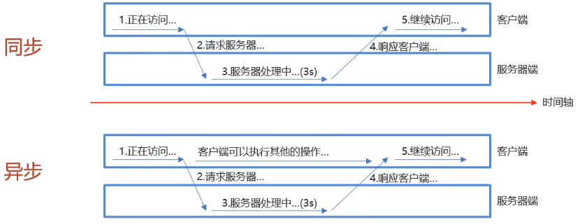
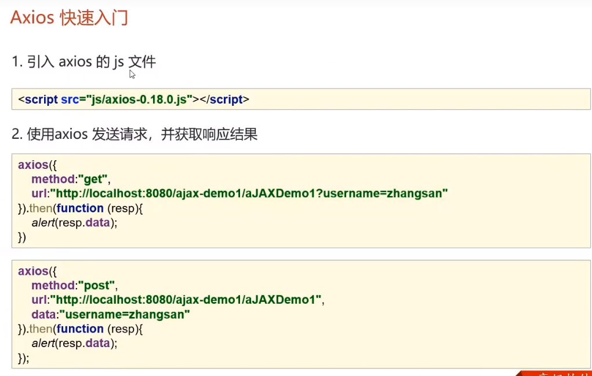

+ 概念: AJAX(Asynchronous JavaScript And XML): 异步的 JavaScript 和 XML
+ AJAX作用: 
  1. 与服务器进行数据交换: 通过 AJAX 可以给服务器发送请求, 并获取服务器响应的数据
     + 使用 AJAX 和服务器进行通信, 可以使用 HTML + AJAX 来<font color='orange'>替换 JSP 页面</font>
  2. <font color='yellow'>异步交互</font>: 



<font color='orange'>**异步交互**和**同步交互**, 区别在于</font>

+ 同步交互, 当用户请求发出后, 服务器需要处理数据(比如3秒), 那么在用户等待服务器响应的这段时间内, 用户不能进行其他操作 

+ 异步交互, 当勇敢请求发出后, 用户在等待服务器响应的时间内可以进行其他操作


# 快速入门

1. 编写 AjaxServlet, 并使用 response 输出字符串

2. 创建 XMLHttpRequest 对象, 用于和服务器交换数据

   ```html
   <script>
       var xmlhttp;
       if (window.XMLHttpRequest){
           xmlhttp = new XMLHttpRequest();
       }else {
           xmlhttp = new ActiveXObject("Microsoft.XMLHTTP");
       }
   </script>
   ```

3. 向服务器发送请求

   ```html
   <script>
       var xmlhttp;
       if (window.XMLHttpRequest){
           xmlhttp = new XMLHttpRequest();
       }else {
           xmlhttp = new ActiveXObject("Microsoft.XMLHTTP");
       }
       // 发送请求🎁
       xmlhttp.open("GET", "url"); //🎁url必须是绝对路径
       xmlhttp.send();// 发送, 必须执行send()
   </script>
   ```

4. 获取服务器响应数据

   ```html
   <script>
       var xmlhttp;
       if (window.XMLHttpRequest){
           xmlhttp = new XMLHttpRequest();
       }else {
           xmlhttp = new ActiveXObject("Microsoft.XMLHTTP");
       }
       // 发送请求🎁
       xmlhttp.open("GET", "url"); //🎁url必须是绝对路径
       xmlhttp.send();// 发送, 必须执行send()
       
       xmlhttp.onreadystatechange=function(){
       if (xmlhttp.readyState == 4 && xmlhttp.status == 200){
           alert(xmlhtttp.responseText)
   	    }
       }
   </script>
   ```

    


# 细节说明

在 AJAX 中，<font color='orange'>XMLHttpRequest 对象是用于在浏览器和服务器之间传递数据的核心对象</font>。它提供了在不重新加载整个页面的情况下向服务器发送 HTTP 请求和从服务器接收数据的功能。XMLHttpRequest 对象允许异步处理，这意味着页面不会被阻塞，而是可以在后台发送和接收数据。

### XMLHttpRequest 对象的基本属性和方法：

#### 常用属性：

1. **onreadystatechange：** 事件处理函数，当 `readyState` 属性改变时触发。
2. **readyState：** 表示请求的状态，有以下几种状态：
   - 0: 请求未初始化
   - 1: 服务器连接已建立
   - 2: 请求已接收
   - 3: 请求处理中
   - 4: 请求已完成，且响应已就绪
3. **status：** HTTP 状态码，表示请求的结果。成功的状态码通常是 200。
4. **responseText：** 服务器响应的文本内容。

#### 常用方法：

1. **open(method, url, async)：** 初始化一个请求。
   - `method`：请求的类型，如 "GET" 或 "POST"。
   - `url`：请求的 URL。
   - `async`：是否异步执行，<font color='orange'>不指定的话, 默认为 true</font>

2. **send()：** 发送请求。

### 如何使用 XMLHttpRequest 对象：

以下是一个简单的使用示例，通过 XMLHttpRequest 发送一个 GET 请求：

```javascript
// 创建 XMLHttpRequest 对象
var xhr = new XMLHttpRequest();

// 配置请求
xhr.open("GET", "https://example.com/api/data", true);

// 注册状态变化的事件处理函数
xhr.onreadystatechange = function () {
    if (xhr.readyState === 4 && xhr.status === 200) {
        // 请求成功，处理响应数据
        console.log(xhr.responseText);
    }
};

// 发送请求
xhr.send();
```

上述代码中，首先创建了一个 XMLHttpRequest 对象，然后配置了一个 GET 请求，指定了请求的 URL 和是否异步执行。接着注册了一个 `onreadystatechange` 事件处理函数，该函数在 `readyState` 发生变化时触发。最后，通过 `send` 方法发送请求。

需要注意的是，在实际开发中，推荐使用更现代的 Fetch API 替代 XMLHttpRequest，因为 Fetch API 更为强大且易用。

# Axios




