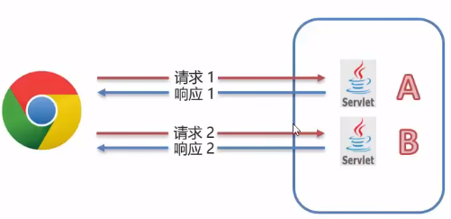
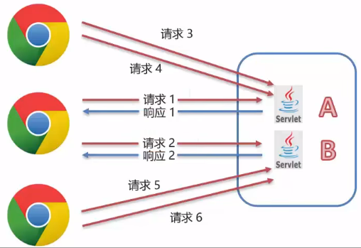
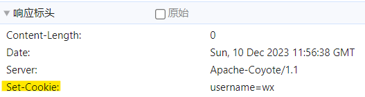
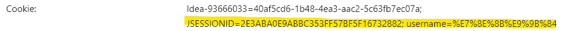
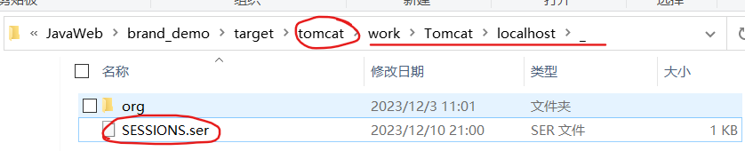

# 概述

+ 会话: 用户打开浏览器, 访问 web 服务器的资源, 会话建立, 直到某一方断开连接, 会话结束, 在一次会话中可以包含<font color='orange'>多次</font>请求和响应



+ 会话跟踪: 一种维护浏览器状态的方法, 服务器需要识别多次请求是否来自同一个浏览器, 以便在同一次会话的多次请求间<font color='orange'>共享数据</font>



+ HTTP 协议是<font color='orange'>无状态</font>的, 每次浏览器像服务器请求时, 服务器都会将该请求视为<font color='orange'>新的</font>请求, 因此我们需要会话跟踪技术实现会话内数据共享
+ <font color='yellow'>实现方式</font>
  1. 客户端会话跟踪技术: <font color='yellow'>Cookie</font>
  2. 服务的会话跟踪技术: <font color='yellow'>Session</font>


# Cookie

## Cookie的基本使用

+ Cookie: 客户端会话技术, 将数据保存到客户端, 以后每次请求都携带 Cookie 数据进行访问

<font color='orange'>Cookie就是服务器 servlet 创建的一个数据, 并在 response 中发送给了客户端</font>

+ <font color='yellow'>Cookie 基本使用</font>

  1. 创建 Cookie 对象, 设置数据

     `Cookie cookie = new Cookie("key", "value");`

  2. 发送 Cookie 到客户端red, 使用 response 对象

     `response.addCookie(cookie);`

  3. 获取客户端携带的所有 Cookie 


## Cookie原理

+ Cookie 是 在处理 request 请求时, 由 response 响应返回浏览器时带回的键值对

```java
@WebServlet(name = "cookie", value = "/cookie")
public class CookieDemo extends HttpServlet {
    @Override
    protected void doGet(HttpServletRequest request, HttpServletResponse response) throws ServletException, IOException {
        //1. 创建Cookie 对象
        Cookie cookie = new Cookie("username", "wx");

        //2. 发送 Cookie response
        response.addCookie(cookie);
    }

    @Override
    protected void doPost(HttpServletRequest request, HttpServletResponse response) throws ServletException, IOException {
        this.doGet(request, response);
    }
}
```

+ 浏览器接到 response 响应头的会携带一个 `set-cookie` 属性



+ 当浏览器接受过 cookie 之后, 就会缓存到内存中, 留到下次访问该服务器时携带

## Cookie使用细节

### Cookie 存活时间

+ 默认情况下, Cookie 存储在浏览器内存中, 当浏览器关闭时, 内存释放, 则 Cookie 被销毁

+ `setMaxAge(int seconds):` <font color='yellow'>设置 Cookie 存活时间</font>
  1. <font color='yellow'>正数</font>: 将 Cookie 写入浏览器所在电脑的硬盘, 持久化存储, 到点自动删除
  2. <font color='yellow'>负数</font>: 默认值, Cookie 在当前浏览器内存中, 当浏览器关闭, 则销毁 Cookie
  3. <font color='yellow'>零</font>: 删除对应的 Cookie


### Cookie 存储中文

+ 默认情况下, Cookie 不能存储中文, 使用 `URLEncoder`重新编码汉字即可
+ <font color='orange'>tomcat7 需要手动编码, tomcat8 无需</font>

```java
@WebServlet(name = "cookie", value = "/cookie")
public class CookieDemo extends HttpServlet {
    @Override
    protected void doGet(HttpServletRequest request, HttpServletResponse response) throws ServletException, IOException {
        //1. 创建Cookie 对象, 使用URLEncoder重新编码字符串
        String value = URLEncoder.encode("王雄", "utf-8");
        Cookie cookie = new Cookie("username", value);

        //2. 发送 Cookie response
        response.addCookie(cookie);
    }

    @Override
    protected void doPost(HttpServletRequest request, HttpServletResponse response) throws ServletException, IOException {
        this.doGet(request, response);
    }
}
```


# Session

## Session基本使用

+ 服务端会话跟踪技术: 将数据保存到服务端
+ JavaEE 提供 HttpSession 接口, 实现一次会话的多次请求键数据共享功能

+ 使用

  1. <font color='yellow'>获取 Session 对象</font>

     `HttpSession session = request.getSession();`

  2. <font color='yellow'>Session 对象功能</font>

     1. `void setAttribute(String name, Object o)` 存储数据到 session 域中
     2. `Object getAttribute(String name)` 根据 key 值, 获取 value 值
     3. `void removeAttribute(String name)` 根据 key 值, 删除键值对


## Session原理

+ <font color='orange'>浏览器没有关闭, 那么对同一个服务器发出的请求就可以获取同一个 Seesion 对象, 其时根据 cookie 的 JSESSIONID 确定的</font>
+ 两个servlet是用一个session哦，只要是同一个会话（浏览器未关闭，同一个域名的访问）那么就是同一个session，具体是通过JSESSIONID来确定的，JSESSIONID存在cookie



+ <font color='orange'>Session 是基于 Cookie 实现的, 在 servlet 中使用 request 获取Session 时, 会自动的在 response 响应头中添加一个 Cookie </font>`set-cookie: JSESSIONID = 一串ID`<font color='orange'>那么当用户在另一个请求中所携带的 cookie 会使得 request 根据 cookie 内的 JSEESIONID 获取到同样的 session 对象</font>


## Session使用细节

+ Session 钝化, 活化
  + 服务器重启后, Session 中的数据是否存在?
  + <font color='yellow'>钝化</font>: 在服务器正常关闭后, Tomcat 会自动将 Session 数据写入硬盘的文件中
  + <font color='yellow'>活化</font>: 再次启动服务器后, 从文件中加载数据到 Session 中
+ <font color='orange'>tomcat 在关闭时会主动的将 Session 数据序列化存入硬盘</font>



+ <font color='yellow'>Session 销毁</font>

  + 默认情况下, 无操作,<font color='yellow'> 30分钟销毁</font>

    ```xml
    <session-config>
        <session-timeout>30</session-timeout>
    </session-config>
    ```

  + 调用 Session 对象的 `invalidate()` 方法

# 总结

+ Cookie 和 Session 都是完成一次会话内多次请求键<font color='orange'>数据共享</font>
+ <font color='yellow'>区别</font>
  1. 存储位置: Cookie 是将数据存储在客户端, Session 是存储在服务器
  2. 安全性: Cookie 不安全, 可能被截获(比如爬虫), Session 安全, 服务器一般不容易被破解
  3. 数据大小: Cookie 最大 3KB, Session 无大小限制
  4. 存储时间: Cookie 可以长期存储, Session 默认 30 分钟
  5. 服务器性能: Cookie 不占服务器资源, Session 占用服务器资源

# 案例


