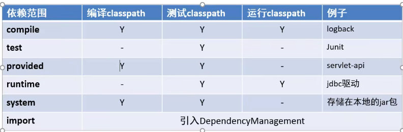
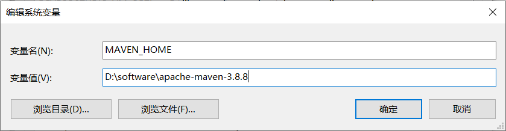
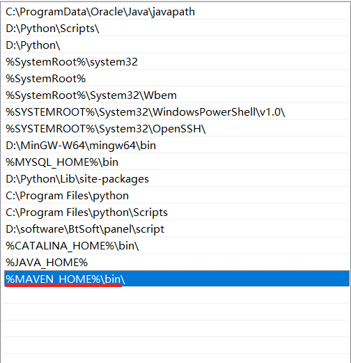
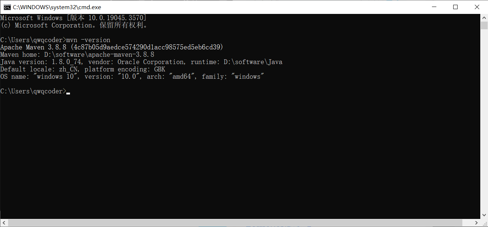
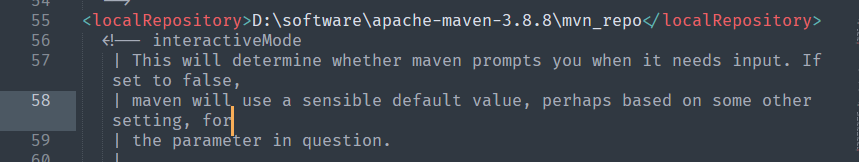
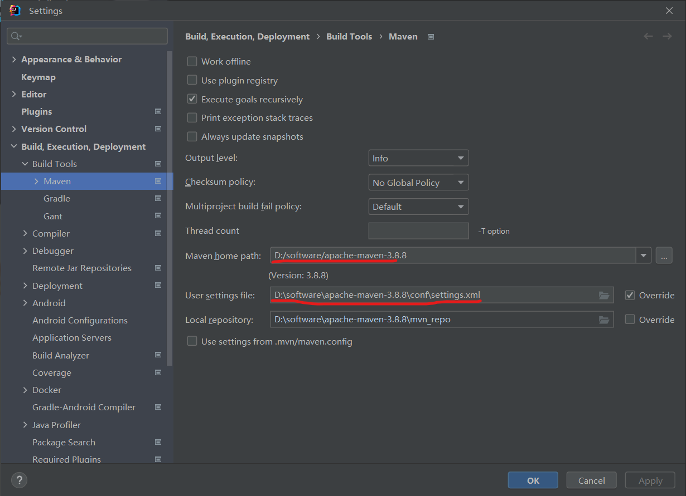
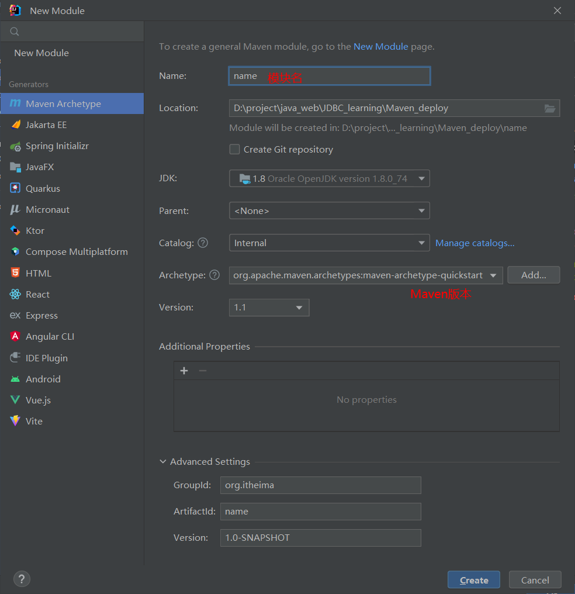

# Maven简介

+ **链接: **[Maven官网](https://maven.apache.org/)

+ **Maven作用**

1. 标准化项目结构
2. 标准化构建流程
3. 方便管理依赖

+ **仓库**

  + 本地仓库: 本地计算机上的某个路径下有一堆**jar包**

  + 中央仓库: 有**Maven**团队维护的全球唯一的仓库

    地址: [](https://repo1.maven.org/maven2/)

  + 远程仓库(私服): 一般由公司团队搭建的自己的仓库

> 本地项目根据坐标引入对应依赖**jar**包后，首先会找本地仓库种是否有对应**jar**包
>
> 如果有：则在项目中直接引用
>
> 如果没有：则去中央仓库种下载对应的**jar**包到本地仓库
>
> + 注意：如果有远程仓库，则在本地仓库中没找到对应依赖**jar**包，会先去远程仓库找，若仍然没有，则去中央仓库下载对应**jar**包到本地仓库和远程仓库


# Maven坐标

+ 什么是坐标？

1. Maven中的坐标是**资源的唯一标识**
2. 使用坐标定义项目或引入项目中所需的依赖

+ **坐标主要组成**

> 1. groupId: 定义当前Maven项目隶属组织名称(通常是域名反写)
> 2. artifactId: 定义当前Maven项目名称(通常是模块名称)
> 3. version: 定义当前项目版本

+ **使用坐标导入jar包**

1. 在`pom.xml`中编写`<dependencies>`标签
2. 在`<dependencies>`标签中使用`<dependency>`标签引入坐标
3. 定义坐标的`groupId,artifactId,version`
4. 点击刷新按钮，使坐标生效

+ **依赖范围**



通过设置坐标的依赖范围（scope），可以设置对应**jar包**的作用范围：编译环境，测试，运行环境

```html
<dependency>
    <groupId>junit</groupId>
    <artifactId>junit</artifactId>
    <version>3.8.1</version>
    <scope>test</scope>  <!-- scope标签,管理依赖的作用范围 -->
</dependency>
```

## 应用举例

在 Maven 构建过程中，当执行 `mvn install`、`mvn package` 或其他构建命令时，Maven 会尝试从 Maven 仓库中获取项目依赖。下面是上述 Maven 依赖的获取过程：

1. **`<dependency>` 元素：**
   
- Maven 依赖通过在项目的 `pom.xml` 文件中使用 `<dependency>` 元素进行声明。这个元素包含了关于依赖的信息，比如 `groupId`、`artifactId`、`version` 和 `scope`。
  
   ```xml
   <dependency>
       <groupId>javax.servlet</groupId>
       <artifactId>javax.servlet-api</artifactId>
       <version>3.1.0</version>
       <scope>provided</scope>
   </dependency>
   ```

2. **Maven 仓库搜索：**
   
- 当执行构建命令时，Maven 会首先检查本地的 Maven 仓库（通常位于用户主目录下的 `.m2/repository` 目录）是否已经存在所需的依赖。如果本地仓库中不存在，Maven 将尝试从中央 Maven 仓库（默认情况下）或其他配置的远程仓库中下载依赖。
  
3. **依赖下载：**
   
- 如果依赖在 Maven 仓库中找到，Maven 将下载相关的 JAR 文件到本地仓库。在这个例子中，它会下载 `javax.servlet-api-3.1.0.jar` 文件。
  
4. **`<scope>` 元素的作用：**
   
   - `<scope>` 元素定义了依赖的范围。在这个例子中，`<scope>provided</scope>` 意味着该依赖在编译时和测试时是必需的，但在运行时由目标环境（例如，Servlet 容器）提供。因此，尽管 Maven 下载了这个依赖，但它不会被打包到最终的构建产物（如 WAR 文件）中，因为在目标环境中已经提供了相应的 API。

总体而言，Maven 通过以上步骤自动管理依赖，从仓库中获取所需的 JAR 文件，并确保构建过程中所有的依赖都被正确处理。

# Maven安装

+ 第一步

下载apache-maven

+ 第二步



在path中添加上Maven的bin路径



+ 第三步

进入cmd，输入`mvn -version`确认Maven环境变量成功添加



+ 第四步

配置本地仓库

[本地仓库默认路径]: C:\Users\qwqcoder\.m2

一般选择在**Maven**安装路径下，创建一个**mvn_repositary**文件夹**作为本地仓库**

同时修改`apache-maven-3.6.1/conf/setting.xml`在其中添加

`<localRepository>D:\software\apache-maven-3.8.8\mvn_repo</localRepository>`



+ 第五步

配置私服仓库(阿里云私服)

修改`apache-maven-3.6.1/conf/setting.xml`在其中添加

```html
<mirror>
      <id>alimaven</id>
      <name>aliyun maven</name>
      <url>http://maven.aliyun.com/nexus/content/groups/public/</url>
      <mirrorOf>central</mirrorOf>
</mirror>
```

# Maven常用命令

+ compile：编译

`mvn compile`生成`target`文件

+ clean：清理

`mvn clean`删除`target`文件

+ test：测试
+ package：打包

`mvn package`在`target`中生成一个**jar**包

+ install：安装

`mvn install`在本地仓库生成一个**jar**包


# IDEA配置Maven

+ 先创建一个空项目
+ 修改**Maven**默认配置(默认**Maven路径和settings.xml**)



+ 然后添加一个**Module**如下

