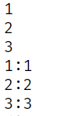

# 快速入门

1. 新建 HTML 页面, 引入 Vue.js文件

```html
<script src="js/vue.js"></script>
```

2. 在 JS 代码区域, 创建 Vue 核心对象, 进行数据绑定

```html
<script>
    // Vue类需要传入一个对象参数
    new Vue({
        el: "#app",
        data(){
            return {
                username: ""
            }
        }
    });
</script>
```

3. 编写视图

```html
<div id="app">
    <input name="username" v-model="username">
    {{username}} //🎁插值表达式
</div>
```


# 常用指令

+ v-bind

  **作用**: 为 HTML 绑定属性值, 如设置 `href`, `css`等

  ```vue
  <a v-bind:href="url">bing.com</a>
  //简化语法(语法糖)
  <a :href="url">bing.com</a>
  
  <script>
      new Vue({
          el: "a",
          data(){
              return {
                  url:""
              }
          }
      })
  </script>
  ```

  

+ v-model

  **作用**: 在表单元素上创建双向绑定, 实现模型和视图的双向绑定

  ```vue
  <input name="useranem" v-model="username">
  
  <script>
      new Vue({
          el: "a",
          data(){
              return {
                  username:""
              }
          }
      })
  </script>
  ```

+ v-on

  **作用**: 为 HTML 标签绑定事件

  ```vue
  <input type="button" value="a btn" v-on:click="show()">
  //🎁第二种语法
  <input type="button" value="a btn" @click="show()">
  <script>
      new Vue({
          el:"input",
          data(){
              return {
                  username:"",
                  url:"https://www.baidu.com"
              }
          },
          methods:{
              show(){
                  alert("i am clicked")
              }
          }
      })
  </script>
  ```

+ v-if      v-else      v-else-if

  **作用**:条件性的渲染某元素, 判定为 true 时渲染, 否则不渲染

  ```vue
  <div v-if="count==3">
  	div1
  </div>
  <div v-else-if="count==2">
      div2
  </div>
  <div v-else>
      div3
  </div>
  ```

+ v-show

  **作用**:根据条件展示某元素, 区别在于切换的是 display 属性值

  ```vue
  <div v-show="count==3">
      div4
</div>
  ```
  
+ v-for

  **作用**: 列表渲染, 遍历容器的元素或者对象的属性

  ```vue
  <div v-for="addr in addrs">
      {{addr}}<br>
  </div>
  <!-- //🎁加索引 -->
  <div v-for="(addr, i)" in addrs>
  	<!-- i表示索引, 从0开始 -->    
      {{i + 1}}:{{addr}}<br>
  </div>
  ```

  




# Vue生命周期


# 案例


