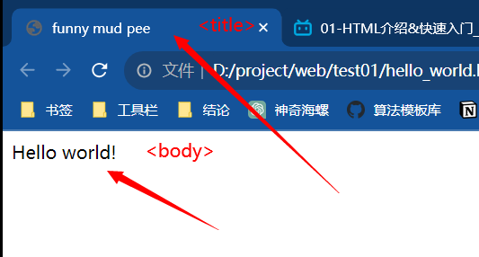
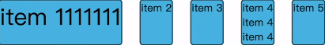

# HTML

+ [教程]:https://www.w3school.com.cn/

+ 全称：HyperText Markup Language 超文本语言

+ html不区分大小写

+ W3C标准：
  1. 结构：HTML
  2. 表现：CSS
  3. 行为：JavaScript

## 基础结构



```html
<!DOCTYPE HTML>
<html>
    <head>
        <title>funny mud pee</title>
    </head>
    <body>
        Hello world!
    </body>
</html>
```

## 基础标签

```html
<!-- 标题标签 -->
<h1>
    
</h1>

<!-- 字体标签, 定义字体尺寸、颜色、样式 -->
<font face="楷体" size="5" color="red"> </font>

<!-- 换行标签 -->
<hr>

<!-- 粗体 -->
<b> </b>

<!-- 定义斜体 -->
<i> </i>

<!-- 定义下划线 -->
<u> </u>

<!-- 水平线标签 -->
<br>

<!-- 居中 -->
<center> </center>
```

### **图片标签**

1. src：规定显示图像的 **URL** 
2. height：定义图像高度
3. width：定义图像宽度

```html

<!-- 
	尺寸单位：
		* px：像素
		* 百分比：
	资源路径：
		* 绝对路径：完整路径(网络url或者本地路径)
		* 相对路径：相对位置(./a.jpg)
-->
```

### **音频标签**

1. src：定义音频的 **URL**
2. controls：显示播放控件

```html
<audio src="b.mp3" controls="controls"></audio>
```

### **视频标签**

1. src：定义视频 **URL**
2. controls：显示视频控件

```html
<video src="c.mp4" controls="controls" width="10" height="10"></video>
```

### **超链接标签**

1. href：指定访问资源的**URL**
2. accesskey: 用来位超链接设置快捷键
3. target：指定打开资源方式
   + _self：默认值，在当前页打开
   + _blank：在空白页打开
   + _parent: 在上一级窗口打开,一般使用框架页时经常使用
   + _top: 在浏览器的整个窗口打开, 忽略任何框架

```html
<a href="https://www.itcast.cn" target="_self"></a>
```

### **列表标签**

一般不使用列表标签自带的样式，使用**css**更改

1. 有序列表

```html
<ol type="A">
    <li>咖啡</li>
    <li>茶</li>
    <li>牛奶</li>
</ol>
```

2. 无序列表

```html
<ul>
    <li>咖啡</li>
    <li>茶</li>
    <li>牛奶</li>
</ul>
```

### **表格标签**

1. table：定义表格
   + border：规定表格边框宽度
   + width：规定表格的宽度
   + cellspacing：规定单元格之间的空白
2. tr：定义行
   + align：定义表格行的内容对齐方式
3. td：定义单元格
   + rowspan：规定单元格可跨越的行数
   + colspan：规定单元格可横跨的行数

```html
<table border="1" cellspacing="0">
    <tr>
        <th>1</th>
        <th>2</th>
        <th>3</th>
    </tr>
    <tr>
        <td>aba</td>
        <td>aba</td>
        <td>aba</td>
    </tr>
    <tr>
        <td>aba</td>
        <td>aba</td>
        <td>aba</td>
    </tr>

</table>
```

### **表单标签**

1. 表单：在网页中主要负责数据采集功能，使用`<form>`标签定义表单

2. 表单项(元素)：不同类型的 input 元素、下拉列表、文本域

3. form：定义表单

   + action：规定当提交表单时向何处发送表单数据(action="#"表示提交到本页面)
   + method：规定用于发送表单数据的方式
     + get：浏览器会将数据直接附在表单的 **action URL** 之后，大小有限制
     + post：浏览器会将数据放到 **http** 请求消息体中。大小无限制
+ target: 指定返回信息的显示方式
     + _blank: 显示在新的窗口
     + _parent: 显示在父级窗口
     + _self: 显示在当前窗口
     + _top: 显示在顶级窗口

==表单项数据想要提交，就必须指定 **name** 属性==


```html
<form action="#" method="post">
    <label for="username">用户名</label>
    <input type="text" name="username" id="username"><br>

    <label for="password">密码</label>
    <input type="password" id="password"><br>

<!--    <label for="male">性别</label>-->
    性别:
    <input type="radio" name="gender" value="1" id="male"><label for="male">男</label>
    <input type="radio" name="gender" value="0" id="female"><label for="female">女</label>
    <br>

    爱好:
    <input type="checkbox" name="hobby" value="1">旅游
    <input type="checkbox" name="hobby" value="2">电影
    <input type="checkbox" name="hobby" value="3">游戏
    <br>

    头像:
    <input type="file"><br>

    城市:
    <select name="city" id="city">
        <option>上海</option>
        <option>南昌</option>
        <option>北京</option>
        <option>九江</option>
    </select><br>

    个人描述:
    <textarea cols="10" rows="3" name="desc" id="desc"></textarea><br>

    <input type="submit">
    <input type="reset">
    <input type="button" value="button">
</form>
```


# css基础

## 样式表导入

**外链式CSS**

+ rel: 定义外部文档和调用文档间的关系
+ href: CSS文档的绝对或相对路径
+ type: 指定外部文件的MIME类型

```html
<style type="text/css">
    <link href = "css文件路径" type = "text/css" rel = "stylesheet" />
</style>
```

**导入式CSS**

```html
<style type="text/css">
    @import url("path")
</style>
```


## CSS选择器

+ 标签选择器：`div{}`
+ 类选择器：`.class{}`
+ id选择器：`#name{}`
+ 通配符选择器：一般不推荐使用


## CSS复合选择器

+ 标签指定选择器

```css
h3.special {
     
}
p#one  {
    
}
```


+ 后代选择器

```css
// p标签下的strong标签
p strong{
    
}
```


+ 并集选择器

```css
h2,h3,p{
    
}
```


## CSS基本样式属性

### 字体样式

+ font-size 属性：字号
  + em：指相对于当前对象内文本字母`m`的字体倍率
  + px：像素单位
  + % ：指相当于当前对象文本默认大小的百分比
+ font-family 属性：字体
+ font-weight 属性：字体粗细
  + normal
  + bold
  + bolder
  + lighter
+ font-style 属性：字体风格
  + normal
  + italic 斜体
  + oblique 斜体
+ font 属性：字体综合设置

```css
p{
	font:font-style font-variant font-weight font-size/line-height 	font-family;
}
```


### 文本外观属性

+ color 属性：文本颜色
+ letter-spacing 属性：字间距
+ word-spacing 属性：词间距
+ line-height 属性：行间距
+ text-decoration 属性：文本装饰
  + none 无
  + underline 下划线
  + overline 上画线
  + line-through 删除线
  + text-align 文本对齐方式
+ text-indent 属性：首行缩进
+ text-align 属性: 指定文本的对齐方式
+ white-space 属性：空白符处理
  + normal 文本中空格无效，满行后自动换行
  + pre 按文档格式保留空白符
  + nowrap 强制不能换行，只显示一行
+ text-shadow 属性：阴影效果

```css
p{
    //           水平       垂直     模糊半径  颜色
    text-shadow: h-shadow  v-shadow  blur  color;
}
```

### 其他

+ display: 指定对象是否集如何显示

+ border: 设置边框的宽度、样式、颜色，可以设置多个属性值，空格间隔

+ background: 设置背景颜色、图片、图片排列

+ margin: 指定对象的外边距

+ padding: 指定对象的内边距

  

# Flex 布局

+ flex-direction: 设置水平排列或竖直排列
  1. column
  2. raw
+ 

```html
<style type="text/css">
    .boss{
    display: flex;
    }
    .boss div{
        background-color: rgb(0, 150, 150);
        border-radius: 15px;
        margin: 10px 0;
        height: 50px;
    }
</style>
<div class="boss">
        <div class="item">item-1</div>
        <div class="item">item-2</div>
        <div class="item">item-3</div>
        <div class="item">
            item-4
            item-4
            item-4
        </div>
        <div class="item">item-5</div>
    </div>
```

​		默认情况下，flex会将容器内每个组件的width设置为max-content，即最大单词长度，只有当容器内所以组件的总宽度远远超过容器宽度，则会将width设置为min-content


```css
.boss{
    display: flex;
    width: 500px; // 如果额外设置父元素宽度
}
.item{
    flex-basis: 50px; // 单独定义每个元素的宽度
    /*
    	5 * (50 + x) = 500
    		x = 100px
    */
    flex-grow: 1;
    
    background-color: rgb(0, 150, 150);
    border-radius: 15px;
    margin: 10px 0;
    height: 50px;
}

// 如果想让某个元素更长一点
.item:nth-child(1){
    flex-grow: 6;
    /*
    	4 * (50 + x) + 50 + 6 * x = 500
    			x = 25px
    */
}
```

**shrink**与flex-grow类似

```html
.boss{
    display: flex;
    width: 500px; // 如果额外设置父元素宽度
}
.item{
    flex-shrink: 1;
    flex-basis: 200px; // 单独定义每个元素的宽度
    /*
    	5 * (200 - x) = 500
    		x = 100px
    */
	   
    background-color: rgb(0, 150, 150);
    border-radius: 15px;
    margin: 10px 0;
    height: 50px;
}

// 如果想让某个元素更短一点
.item: nth-child(1){
    flex-shrink: 2;
    /*
    	4 * (200 - x) + 200 - 2 * x = 500
    			x = 250/3 px
    */
}
```


## flex简化语法

```html
flex: 1; // flex: 1 1 auto;
flex: initial; // flex: 0 1 auto;
flex: auto; // flex: 1 1 auto;
flex: none; // flex: 0 0 auto;
```


## flex样式属性

### align-items 

**属性**：元素在交叉轴上的分布

+ stretch 令所有元素都有统一行高，定义为行高最大元素的值

+ flex-start 从交叉轴起点开始对齐
+ flex-end 从交叉轴终点开始对齐
+ center 在交叉轴中点对齐
+ baseline 用元素中的文本基线对齐


### justify-content

**属性**：主轴上的对齐

+ flex-start 主轴起点对齐
+ flex-end 主轴终点对齐
+ center 在主轴中点对齐
+ space-between 两头顶格，中间有空隙



+ space-around 在space-between基础上给两天留出空隙 x，x是中间空隙的一半
+ space-evenly 全部均匀分布，并且两天有空隙


### flex-wrap

**属性**：主轴元素换行样式

+ wrap 一行铺满，自动换行
+ wrap-reverse 反向
+ normal


### align-content

**属性**：交叉轴元素换行样式

+ normal
+ flex-start 
+ flex-end
+ flex-between
+ flex-around
+ flex-evenly


