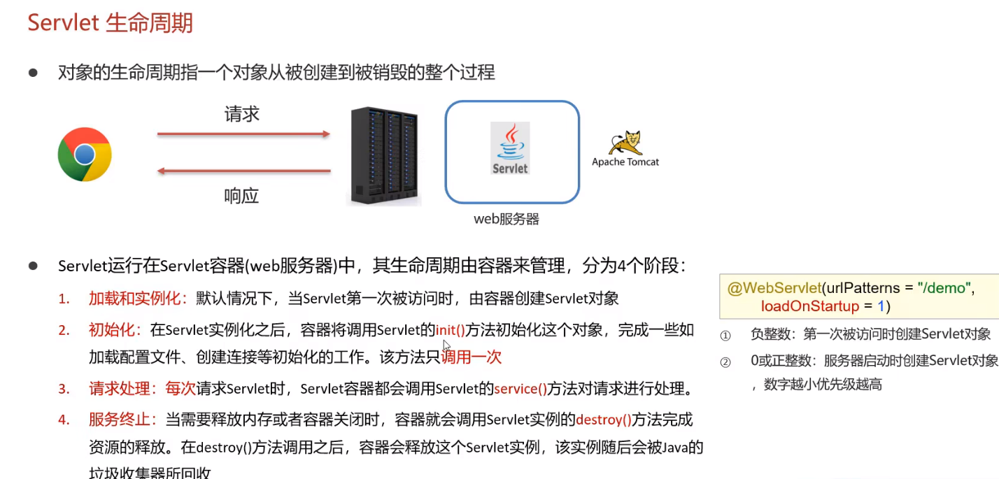
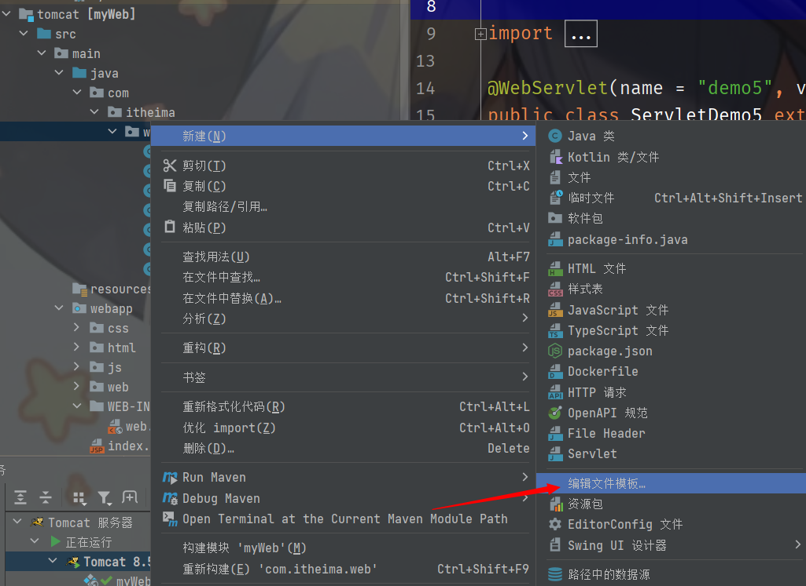
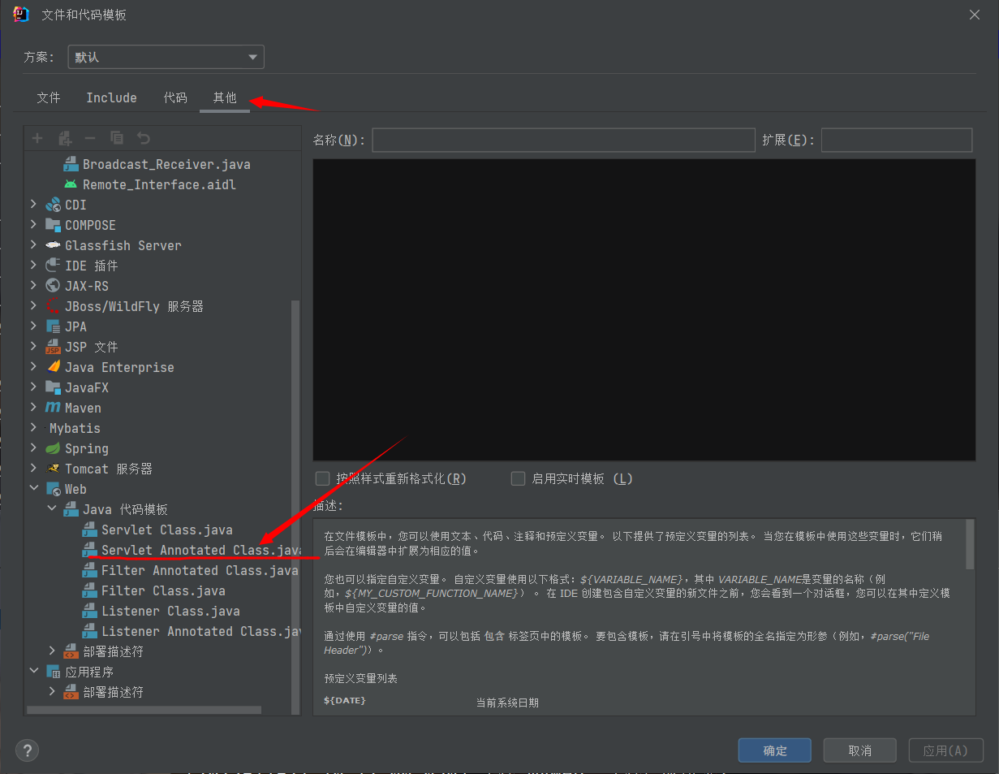
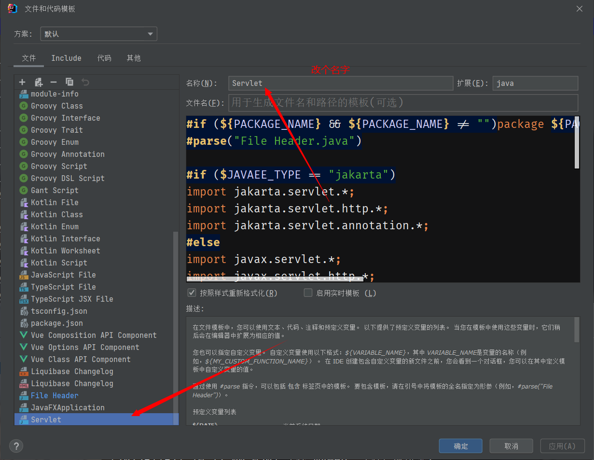

+ **Sevlet是一门动态web资源的开发技术，即不同用户的访问可以得到不同的网页**
+ 

# 快速入门

1. 创建 web 项目，导入 Servlet 依赖坐标

```xml
<dependency>
    <groupId>javax.servlet</groupId>
    <artifactId>javax.servlet-api</artifactId>
    <version>3.1.0</version>
    <scope>provided</scope>
</dependency>
```

2. 定义一个类，实现 Servlet 接口，并重写接口中的所有方法

```java
public class ServletDemo1 implements Servlet {
    public void service(ServletRequest servletRequest, ServletResponse servletResponse) throws ServletException, IOException {
        System.out.println("servlet hello world!");
    }
    public String getServletInfo() {
        return null;
    }
    public void destroy() {}
    public ServletConfig getServletConfig() {
        return null;
    }
    public void init(ServletConfig servletConfig) throws ServletException {}
}
```

3. 在类上使用 `@WebServlet` 注解，配置该 Servlet 的访问路径

```java
@WebServlet("/demo1")
public class ServletDemo1 implements Servlet{}
```

4. 启动 Tomcat，浏览器输入 URL 访问该 Servlet

```markdown
http://localhost:8080/web-demo/demo1
```


# WebServlet注解

在`@WebServlet`注解中，`name`和`value`参数都用于指定Servlet的映射路径，但它们的语义略有不同：

1. **value参数：** 用于定义处理HTTP请求的Servlet的URL模式。它表示Servlet可以处理的一个或多个路径。例如，`@WebServlet(value = "/resp3")`表示该Servlet将处理以`/resp3`为路径的HTTP请求。

2. **name参数：** 用于指定Servlet的名称。Servlet名称是在Web应用程序中**唯一**的，它在整个应用程序中**标识**这个Servlet。如果没有显式提供`name`参数，容器将使用Servlet类的简单类名（不包括包名）作为默认名称。

在你的示例中：

```java
@WebServlet(name = "resp3", value = "/resp3")
```

这表示Servlet的名称是`resp3`，而它可以处理以`/resp3`为路径的HTTP请求。如果没有提供`name`参数，容器会自动生成一个默认的名称。

---

总的来说，`value`参数用于指定Servlet的URL模式，而`name`参数用于指定Servlet的名称。在大多数情况下，我们主要关注`value`参数，因为它定义了Servlet的映射路径。


# Servelt接口

+ Servlet 运行在 Servlet 容器（web服务器）中，其生命周期有容器管理，分为 4 个阶段：
  1. **加载和实例化**：默认情况下，当 Servlet 第一次被访问时，容器创建 Servlet 对象
  2. **初始化**：在 Servlet 实例化后，容器将调用 Servlet 的 `init()` 方法初始化这个对象，完成一些如加载配置文件、创建连接等初始化的工作。该方法**只调用一次**
  3. **请求处理**：**每次**请求 Servlet 时，Servlet 容器都会调用 Servlet 的 `service()` 方法，对请求进行处理
  4. **服务终止**：当需要释放内存或者容器关闭时，提前就会调用 Servlet实例的 `destroy()` 方法完成资源的释放，并销毁这个 Servlet 实例

```java
package com.itheima.web;

import javax.servlet.*;
import javax.servlet.annotation.WebServlet;
import javax.servlet.http.HttpServletRequest;
import java.io.IOException;

/*
 *   😋loadOnStartup = 1 表示类在加载时就创建, 而不会等到调用时再创建
 * */
@WebServlet(value = "/demo2", loadOnStartup = 1)
public class ServletDemo2 implements Servlet {
    /*
     *   调用时机: 默认情况下, Servlet被第一次访问时, 会调用
     *   调用次数: 一次
     * */
    public void init(ServletConfig servletConfig) throws ServletException {

    }

    /*
     *   😀调用时机: 每一次调用servlet对象被访问时,都会调用
     *   req:  包含某些请求数据
     *   res: 可以返回某些响应数据
     * */
    public void service(ServletRequest req, ServletResponse res) throws ServletException, IOException {
        HttpServletRequest request = (HttpServletRequest) req;

        //获取请求方式
        String requestMethod = request.getMethod();
        //判断get请求或post请求, 分别处理
        if("GET".equals(requestMethod)){
            //get处理逻辑
            doGet(req, res);
        }else if("POST".equals(requestMethod)){
            //post处理逻辑
            doPost(req, res);
        }
    }

    protected void doPost(ServletRequest req, ServletResponse res) {
    }

    protected void doGet(ServletRequest req, ServletResponse res) {
        
    }

    /*
     *   调用时机: 内存被释放或者服务器被关闭时, Servlet对象会被注销
     * */
    public void destroy() {
        System.out.println("servlet is break down");
    }

    public String getServletInfo() {
        return null;
    }


    public ServletConfig getServletConfig() {
        return null;
    }
}
```

# urlPattern配置

+ Servlet 要想被访问，必须配置访问路径（urlPattern）

  1. **一个 Servle 可以配置多个 urlPattern**

  2. **配置规则**

     + 精确匹配：
       1. 配置路径：`@WebServlet("user/select")`

       2. 访问路径：`localhost:8080/user/select`

     + 目录匹配：
       1. 配置路径：`@WebServlet("user/*")`

       2. 访问路径：`localhost:8080/user/所有文件`

     + 扩展名匹配：
       1. 配置路径：`@WebServlet("*.out")`

       2. 访问路径：`localhost:8080/中所有out后缀文件`

     + 任意匹配：
       1. 配置路径：`@WebServlet("/*")`

       2. 访问路径：`localhost:8080/所有文件`

# 常见问题

+ 运行maven-tomcat7时出现

> [ERROR] 不再支持源选项 5。请使用 7 或更高版本。
> [ERROR] 不再支持目标选项 5。请使用 7 或更高版本。

需要在pom.xml文件中添加`properties`标签，说明当前jdk版本

```xml
    <properties>
        <project.build.sourceEncoding>UTF-8</project.build.sourceEncoding>
                <maven.compiler.source>17</maven.compiler.source>
                <maven.compiler.target>17</maven.compiler.target>
    </properties>
```




## 新建菜单缺失servlet文件

+ 需要手动添加servlet文件代码模板





把其他选项卡中的servlet模板复制粘贴到文件选项卡中去



然后新建菜单中就出现了servlet文件