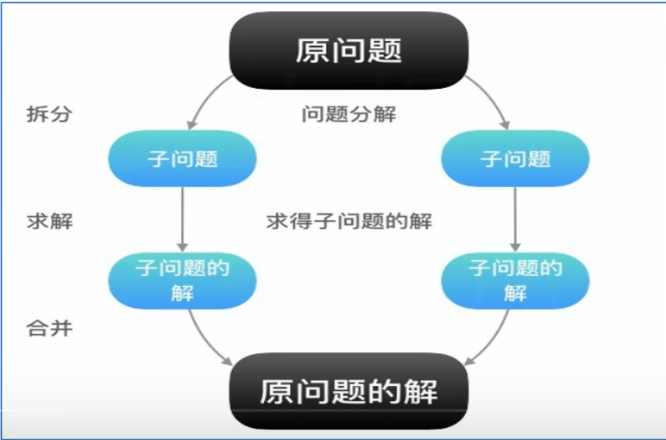
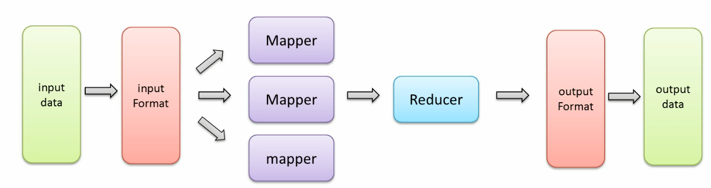
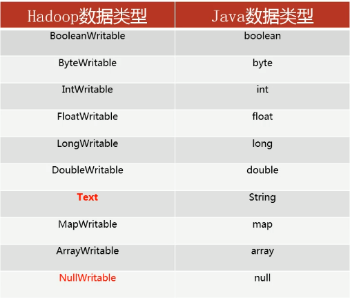
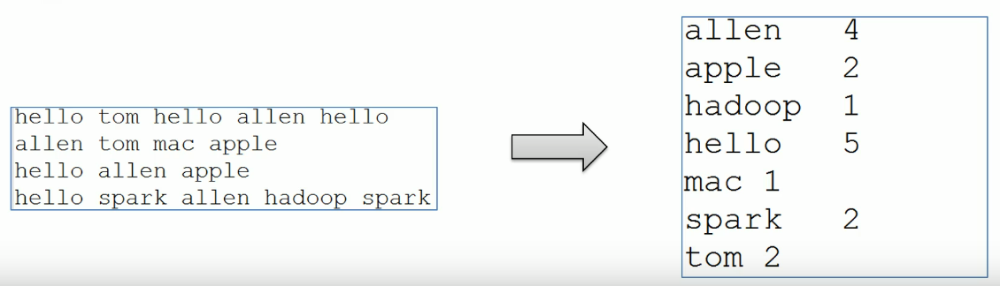
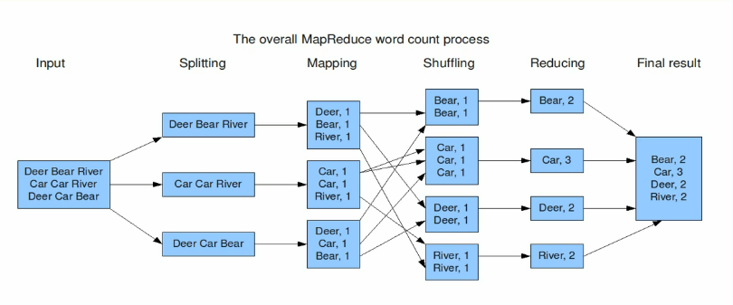

# 初识MapReduce

## MapReduce思想

+ **核心思想**： "先分再合, 分而治之"



+ **分布式计算**：和集中式计算相对，利用集群中多台计算机，将应用分解成多个小部分，分配给集群完成

+ **分布式计算过程**：

  1. **map阶段**：

     将程序拷贝放入集群中不同计算机中，进行局部并行计算（移动程序的成本远低于数据的移动成本）

  2. **reduce阶段**

     将map阶段的输出局部结果进行全局汇总


# Hadoop MapReduce简介

## MapReduce特点

+ **高容错性**：Hadoop集群式分布式搭建和部署的，任何单一机器节点宕机了，它都可以将上面的计算任务转义到另一个节点上运行，不影响整体业务的运行，该过程完全由Hadoop自主完成
+ **适合海量数据的离线处理**：可以处理GB、TB和PB级别的数据量

## MapReduce局限

+ **实时计算性能差：**MapReduce主要应用于离线作业，无法做到秒级和亚秒级数据响应
+ **不能进行流式计算：**流式计算特点是数据源源不断的计算，并且数据是动态的；但是MapReduce作为一个离线计算框架，主要针对的是静态数据集，数据是不能动态变化的

# Hadoop MapReduce编程

## MapReduce架构体系

+ 一个完整的MapReduce程序在分布式运行时由**三类实例进程**
  1. **MRAPPMaster：**负责整个程序的过程调度及状态协调
  2. **MapTask：** 负责map阶段的整个数据处理流程
  3. **ReduceTask：**负责reduce阶段的整个数据处理流程
+ **一个MR程序只能包含一个Map阶段和一个Reduce阶段**


## MapReduce编程规范

+ 用户编程的**程序代码**分成三个部分：**Mapper**、**Reducer**、**Driver**(客户端提交作业驱动程序)
+ 用户自定义的Mapper和Reducer都要继承各自的父类。

> Mapper中的业务逻辑写在`map()`方法中
>
> Reducer的业务逻辑写在`reduce()`方法中
>
> 整个程序需要一个Driver来进行提交，提交的是一个描述了各种必要信息的**job对象**

```java
public class UserMapper extends Mapper{
    @Override
    protected void map(Object key, Object value, Context context) throws IOException, InterruptedException{
        
    }
}

public class UserReducer extends Reducer{
    @Override
    protected void reduce(Object key, Iterable values, Context context) throws IOException, InterruptedException{
        
    }
}
```

+ ==注意：==整个MapReduce程序中，数据都是以**KV键值对**的形式流转的
+ 在实际编程解决各种业务问题时，需要考虑每个阶段**输入输出KV**分别是什么
+ MapReduce内置了很多默认属性，比如排序、分组等等，都和数据的**K**有关

## MapReduce内部执行流程-基础版

+ **组件**：读取数据组件**InputFormat**，输出数据组件**OutputFormat**
+ **行为**：排序（key的字典序排序）、分组（reduce阶段key相同的分为一组，一组调用一次reduce处理）




# Hadoop MapReduce序列化机制

## 什么是序列化

+ **概念：**
  1. **序列化(Serialization)**：是将**结构化对象**转换成**字节流**对象，以便进行网络传输或写入持久存储的过程
  2. **反序列化(Deserialization)：**是将**字节流**转换为一系列**结构化对象**的过程，重新创建该对象

## 序列化机制

### Java机制

+ Java对象序列化的机制，把对象表示成一个**二进制的字节数组**，其中包含了对象的数据，对象的类型，对象内部的数据类型信息等等，通过保存或者转移数组达到持久化、传递的目的
+ 要实现序列化，需要实现 **java.io.Serializable** 接口，反序列化是和序列化相反的过程

### Hadoop机制

+ Hadoop的序列化没有采用Java的序列化机制，而是实现了自己的序列化机制**Writable**
+ 原因在于Java的序列化机制过于臃肿，序列化过程中不断地创建对象，并且会额外附带很多信息（校验、继承关系等等）
+ 在Hadoop的序列化机制中，用户可以复用对象，减少了java对象的分配和回收，提高了应用效率

```java
public interface Writable{
    //write是序列化方法，用于把对象指定的字段写出去
    void write(DataOutput out) throws IOException;
    
    //readFields是反序列化方法，用于从字节流中读取字段重构对象
    void readFields(DataInput in) throws IOException;
}
```

## 数据类型




# MapReduce经典入门

## WordCount

**任务需求**：词频统计，统计指定文件中，每个单词出现的总次数





## 搭建开发环境

+ 导入 maven 坐标

```xml
<dependencies>

    <dependency>
      <groupId>junit</groupId>
      <artifactId>junit</artifactId>
      <version>3.8.1</version>
      <scope>test</scope>
    </dependency>

    <dependency>
      <groupId>org.apache.hadoop</groupId>
      <artifactId>hadoop-common</artifactId>
      <version>3.1.4</version>
    </dependency>

    <dependency>
      <groupId>org.apache.hadoop</groupId>
      <artifactId>hadoop-hdfs</artifactId>
      <version>3.1.4</version>
    </dependency>

    <dependency>
      <groupId>org.apache.hadoop</groupId>
      <artifactId>hadoop-client</artifactId>
      <version>3.1.4</version>
    </dependency>

    <dependency>
      <groupId>org.apache.hadoop</groupId>
      <artifactId>hadoop-mapreduce-client-core</artifactId>
      <version>3.1.4</version>
    </dependency>

  </dependencies>
```

+ 设置日志输出格式


`log4j.properties` 文件是 Log4j 日志框架的配置文件，用于指定日志记录的行为。以下是一个简单的 `log4j.properties` 文件示例：

```properties
# 设置日志级别
log4j.rootLogger=DEBUG, Console

# 控制台输出的日志格式
log4j.appender.Console=org.apache.log4j.ConsoleAppender
log4j.appender.Console.layout=org.apache.log4j.PatternLayout
log4j.appender.Console.layout.ConversionPattern=%d{yyyy-MM-dd HH:mm:ss} %-5p %c{1}:%L - %m%n

# 文件输出的日志格式
log4j.appender.File=org.apache.log4j.RollingFileAppender
log4j.appender.File.File=example.log
log4j.appender.File.MaxFileSize=1MB
log4j.appender.File.MaxBackupIndex=5
log4j.appender.File.layout=org.apache.log4j.PatternLayout
log4j.appender.File.layout.ConversionPattern=%d{yyyy-MM-dd HH:mm:ss} %-5p %c{1}:%L - %m%n
```

在这个示例中：

1. `log4j.rootLogger=DEBUG, Console` 设置根日志记录器的级别为 `DEBUG`，并将日志输出到 `Console`。

2. `log4j.appender.Console` 部分配置了控制台输出的日志格式。

3. `log4j.appender.File` 部分配置了文件输出的日志格式。日志会输出到 `example.log` 文件，同时通过 `MaxFileSize` 和 `MaxBackupIndex` 控制文件滚动的方式。

4. `%d{yyyy-MM-dd HH:mm:ss} %-5p %c{1}:%L - %m%n` 是日志输出的格式，其中：
   - `%d{yyyy-MM-dd HH:mm:ss}` 表示日期和时间，
   - `%-5p` 表示日志级别（左对齐，占5个字符），
   - `%c{1}:%L` 表示类名的缩写和行号，
   - `%m%n` 表示消息和换行。

你可以根据自己的需求进行调整和扩展。这只是一个简单的配置示例，实际的配置可能会更加复杂，取决于你的项目需求和日志记录策略。


## 代码结构


# MapReduce程序运行模式


# MapReduce输入输出特点


# MapReduce执行流程梳理