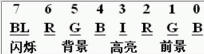

# 寄存器种类

+ 通用寄存器: **AX, BX, CX, DX**
+ 变址寄存器: **SI, DI**
+ 指针寄存器: **SP, BP**
+ 指令指针寄存器: **IP**
+ 段寄存器: **CS, SS, DS, ES**
+ 标志寄存器: **PSW**

# Debug命令

+ R命令	查看和改变CPU寄存器内容

**改变指定寄存器内容(ax寄存器)**


+ D命令    查看内存中的内容

+ E命令     改变内存中的内容


+ U命令    将内存中的机器指令翻译成汇编指令
+ A命令    以汇编指令的格式在内存中写入机器指令
+ T命令     执行机器指令


# jmp指令

**同时修改CS, IP的内容**

```assembly
jmp 段地址:偏移地址
```

**仅修改IP内容**

```assembly
# 段内转移,只修改IP
jmp ax		# 其中 cs寄存器内容保持不变
jmp bx
# 段间转移,同时修改CS和IP
jmp 1000:0
# 短转移
jmp short 标号 # 跳转至标号指定的地址,跳转范围-128到127
# 近转移
jmp near ptr 标号 # 跳转指标号指定地址,跳转范围-32769~32767
				 # 直接指明相对于当前IP的地址偏移量
# 远转移
jmp far ptr 标号 # 指明跳转到的标号所在指令内存地址
```

# loop命令

1. 在 **cx** 寄存器中存放循环次数
2. 用**标号**指定循环结构开始的位置
3. 在**标号**和**loop**指令中间,写下代码段

```assembly
assume cd:code
code segment
	mov ax, 2
	mov cx, 11
 s: add ax, ax
 	loop s
 	
 	mov ax, 4c00h
 	int 21h
 code ends
 end
```

# div命令

+ `div`是除法命令
  + **被除数**默认放在 `AX`   或    `DX`和`AZ`中
  + **除数**是8位或16位,在寄存器或内存单元中


| 被除数 |       ax        |      dx和ax      |
| :----: | :-------------: | :--------------: |
|  除数  | 8位内存或寄存器 | 16位内存或寄存器 |
|   商   |       AL        |        AX        |
|  余数  |       AH        |        DX        |

# mul命令

|        | 8位乘法             | 16位乘法               |
| ------ | ------------------- | ---------------------- |
| 被乘数 | **AL**              | **AX**                 |
| 乘数   | 8位寄存器或内存单元 | 16位寄存器或内存单元   |
| 结果   | **AX**              | **DX(高位)和AX(低位)** |

```assembly
; 8位乘法
mul bl  ; (ax) = (al) * (bl)

mul byte ptr ds:[0] ; (ax) = (al) * ((ds) * 16 + 0)

; 16位乘法
mul word ptr ds:[bx + si + 8]
```


# dup命令

+ 功能: `dup`和`db,dw,dd`等数据定义位置了配合使用,用于进行数据的重复

| 指令                   | 功能                      | 相当于               |
| ---------------------- | ------------------------- | -------------------- |
| db 3 dup (0)           | 定义3个字节               | db 0,0,0             |
| db 3 dup (0,1,2)       | 定义9个字节               | db 0,1,2,0,1,2,0,1,2 |
| db 3 dup ('abc','ABC') | 定义18个字节,构成'abcABC' |                      |

+ 格式: `db/dw/dd 重复次数 dup (重复的 字节型/字型/双字 数据)`


# 操作符offset

+ 格式: `offset 标号`
+ 作用: 将标号位置处的**指令**相对于段地址的偏移量读取出来

# jcxz指令

+ 格式: `jcxz 标号`
+ 功能: 如果 `cx` 寄存器为 $0$, 则转移到标号地址, 否则什么都不做


# call和ret指令

+ 格式: `call + 地址`
+ 作用: 转移到目标地址

```assembly
# call + 标号, 作用类似jmp near ptr, 对应的机器指令中为相对当前IP偏移
call s
mov ax, 4c00h
int 21h

s: add ax, 1
   ret

# call far ptr + 标号, 作用为段间转移, 对应机器指令为段地址加偏移地址

# call + 16位寄存器, 作用为段内转移, 寄存器中是相对当前IP的偏移量

# call word ptr 内存单元地址, 作用为段内转移,寄存器中是相对当前IP的偏移

# call dword ptr 内存单元地址,作用为段间转移, 寄存器内是段地址和偏移地址,其中高地址位段地址,低地址位偏移地址
```

```assembly
assume cs:codesg, ss:stack
stack segment
          db 16 dup (0)
stack ends
codesg segment
           mov  ax, 4c00h
           int  21h
    start: mov  ax, stack
           mov  ss, ax
           mov  sp, 16
           mov  ax, 0
           push ax
           mov  bx, 0
           ret ; 返回mov ax, 4c00h指令
codesg ends
end start
```

|      ret      |          retf           |
| :-----------: | :---------------------: |
| 相当于 pop IP | 相当于 pop IP 再 pop CS |


# 用于内存寻址的寄存器用法

**正确指令**

```assembly
mov ax, [bx]
mov ax, [bx + di]
mov ax, [bx + si]
mov ax, [bp]
mov ax, [bp + di]
mov ax, [bp + si] ;只有bx,bp,si,di可以用在[..]中,对内存单元进行寻址
```

**错误指令**

```assembly
mov ax, [cx]
mov ax, [ax]
mov ax, [dx]
mov ax, [ds] ;bx以外的通用寄存器和段寄存器不能用在[..]中
mov ax, [bp + bx]
mov ax, [si + di] ;bx默认段地址使用ds段,bp默认段地址使用ss段
```

# 标志寄存器

**标志寄存器又称: PSW/FLAGS**

+ **flag寄存器**按位起作用, 每个位都有专门的含义, 记录特定信息
+ **8086cpu**中没有使用**flag**的1,3,5,12,13,14,15位, 这些位不具备任何含义


 

| 标志          | 值为1 | 值为0 | 意义 |
| ------------- | ----- | ----- | ---- |
| OF(Overflow)  | OV    | NV    | 溢出 |
| DF(Direction) | DN    | UP    | 方向 |
| SF(Sign)      | NG    | PL    | 符号 |
| ZF(Zero Flag) | ZR    | NZ    | 零值 |
| PF(Parity)    | PE    | PO    | 奇偶 |
| CF(Carry)     | CF    | CY    | 进位 |

**直接访问标志寄存器的方法**

+ `pushf` : 将标志寄存器的值压入栈
+ `popf`: 从栈中弹出数据, 送入标志寄存器

**观察寄存器的值**

+ 使用`debug`的`-r`命令


==在**8086CPU**中有的指令可以影响标志寄存器, 比如:`add, sub, mul, div, inc, or, and`等等, 大都是运算指令,进行逻辑运算或算数计算==

## **各个标志位的作用**

+ **ZF零标志**
  + `ZF = 1`表示运算结果是 $0$, $1$表示"逻辑真"
  + `ZF = 0`表示运算结果是 $1$, $0$表示"逻辑假" 
+ **PF奇偶标志**
  + PF记录结果中所有二进制位中 $1$ 的个数
  + `PF = 1`表示运算结果包含偶数个 $1$
  + `PF = 0`表示运算结果包含奇数个 $1$
+ **SF符号标志**
  + ==注意**SF标志**仅仅在有符号运算中有意义,无符号运算也可以影响**SF标志**, 但是没有意义==
  + `SF = 1`结果为负数
  + `SF = 0`结果为正数
+ **CF进位标志**
  + `CF = 1`表示有进位或借位
  + `CF = 0`表示无进位或借位
+ **OF溢出标志**
  + ==注意**溢出**仅针对**有符号数**运算==
  + `OF = 1`表示有溢出
  + `OF = 0`表示无溢出

> **CF和OF的区别**
>
> 1. **CF**是对**无符号数**运算有意义的**进/借位**标志
>
> 2. **OF**是对**有符号数**运算有意义的**溢出**标志
>
>    

+ **DF方向标志**
  + 在串处理指令中, 控制每次操作后si, di的增减
  + `DF = 0`表示每次操作后si, di递增
  + `DF = 1`表示每次操作后si, di递减

> **串传送指令1: movsb**
>
> ==cld清零DF寄存器, std置一DF寄存器==
>
> **功能: **以字节为单位
>
> 1. ((es) * 16 + (di)) = ((ds) * 16  + (si))
> 2. 如果 `DF = 0`则 (si) = (si) + 1, (di) = (di) + 1
> 3. 如果 `DF = 1`则 (si) = (si) - 1, (di) = (di) - 1
>
> **串传送指令2: movsw**
>
> **功能: **以字为单位传送
>
> 1. ((es) * 16 + (di)) = ((ds) * 16  + (si))
> 2. 如果 `DF = 0`则 (si) = (si) + 2, (di) = (di) + 2
> 3. 如果 `DF = 1`则 (si) = (si) - 2, (di) = (di) - 2

# 移位指令


==注意: `shl al, 立即数`, 如果指令中移位数量用立即数表示, 则立即数只能是1==

# 操作显存




+ 终端窗口分为80列20行, 每列都是一个字
+ 显示缓冲区地址从**0B800H**开始

```assembly
10001111b
assume cs:code, ds:data
data segment
    db 'welcome to masm'
data ends

code segment
start: mov ax, data
        mov ds, ax
        mov ax, 0b800h
        mov es, ax
        mov si, 0
        mov di, 160 * 13 + 120

        mov cx, 16
w:      mov al, [si]
        mov es:[di], al
        inc di
        mov al, 71h
        mov es:[di], al
        inc si
        inc di
        loop w

        mov ax, 4c00h
        int 21h

code ends
end start
```

# 中断

+ 概念: **CPU**不再接着(刚执行的指令)向下执行, 而是转去处理中断信息
+ 内中断: 由**CPU**内部发生的事件而引起的中断
+ 外中断: 由外部设备发生的事件而引起的中断


**中断向量表**

>由中断类型码, 查表得到中断处理程序的入口地址,从而定位中断处理程序
>
>中断向量表共1024个字节, 从0000:0000到0000:03FE
>
>(IP) = (N * 4), (CS) = (N * 4 + 2), N 为中断类型码

**内中断**

0. 除法错误: 比如执行**div**指令产生的除法溢出

1. 单步中断: **TF标志**为一使得**CPU**工作在单步中断的方式下
2. int引发中断: `n` 为中断类型码

**中断处理程序的入口地址(中断向量),必须存储在对应的中断向量表表项中**

==(0000:0000-0000:03FF)共1024个字节==


**编写中断处理函数**

+ 中断处理函数向量，应该放在（0000:0200-0000:02FF）中，因为8086自带256种中断
+ `int 中断向量`可以直接触发中断程序，系统自动执行`pushf,push CS,push IP`

```assembly
;编写可以显示"overflow!"的中断处理程序
assume cs:code
code segment
start:	;安装do0程序
		mov ax, cs
		mov ds, ax
		mov si, offset do0
		mov ax, 0
		mov es, ax
		mov di, 0200h
		mov cx, offset do0end - offset do0 ;计算do0程序长度
		cld
		rep movsb
		
		;设置中断向量
		mov ax, 0
		mov es, ax
		mov word ptr es:[0 * 4], 200h
		mov word ptr es:[0 * 4 + 2], 0
		
		mov ax, 4c00h
		int 21h
		
do0:	;显示字符串
		jmp short do0start
		db "overflow!"
		
do0start:
		mov ax, cs
		mov ds, ax
		mov si, 202h
		mov ax, 0b800h
		mov es, ax
		mov di, 12 * 160 + 36 * 2
		mov cx, 9
s:		mov al, [si]
		mov es:[di], al
		inc si
		add di, 2
		loop s
		mov ax, 4c00h
		int 21h
do0end:	nop

code ends
end start
```


# BIOS操作

+ **BIOS**中的主要内容
  1. 硬件系统的检测和初始化程序
  2. 外部中断和内部中断的中断例程
  3. 用于对硬件设备进行I/O操作的中断例程
  4. 其他和硬件系统相关的中断例程
+ **BIOS容量**: 8KB
+ **BIOS地址**: FE000H开始


```assembly
# ah 功能号
/*
	实现在屏幕第5行12列显示3个红底高亮闪烁绿色的'a'
*/
assume cs:code
code segment
start:	
		mov ah, 2 			;设置光标位置, 02H功能
		mov bh, 0			;设置页数
		mov dh, 5			;设置行	
		mov dl, 12			;设置列
		int 10h
		
		mov ah, 9
		mov al, 'a'
		mov bl, 11001010b
		mov bh, 0
		mov cx, 3
		int 10h
		
		mov ax, 4c00h
		int 21h
code ends
end start
```

# 端口读写

 
