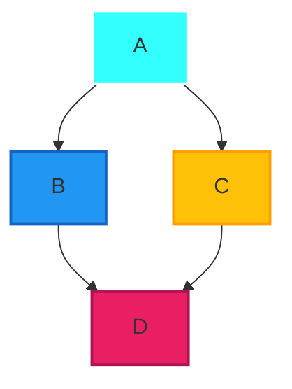
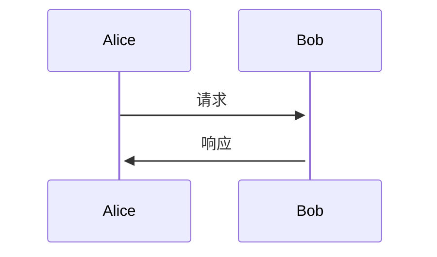
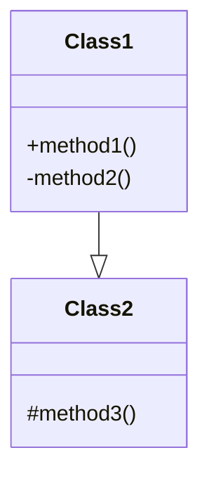

[Mermaid](https://mermaid-js.github.io/mermaid/#/) 是一个用于绘制流程图、时序图、甘特图等各种图表的开源工具。它使用简单的文本语法，允许用户轻松地创建各种图表而无需手动绘制。

下面是一些基本的 Mermaid 语法和示例：

### 1. 流程图



这个示例创建了一个简单的流程图，其中有四个节点：A、B、C、D。箭头表示流向。

### 2. 时序图



这个示例创建了一个简单的时序图，其中有两个参与者：Alice 和 Bob。箭头表示消息的流向。

### 3. 甘特图

```mermaid
1\gantt
  title 甘特图示例
  section Section
  A任务           :a1, 2023-01-01, 30d
  另一项任务      :after a1  , 20d
  section 另一段
  完成任务        : 12d
  另一个任务      : 24d
```

这个示例创建了一个简单的甘特图，展示了两个部分中的任务和它们的计划开始和结束日期。

### 4. Class Diagram（类图）



这个示例创建了一个简单的类图，其中有两个类：Class1 和 Class2，以及它们之间的关系和方法。

### 使用方法：

1. 在你的 Markdown 文档中引入 Mermaid 库。可以通过以下方式之一：
   - 在 HTML 头部中引入 `<script>` 标签。
   - 使用包管理工具（如 npm 或 yarn）安装 mermaid 库并在文档中引入。

2. 使用 Mermaid 语法创建你想要的图表。

3. 预览或导出文档，你将看到 Mermaid 图表已经渲染出来了。

这只是 Mermaid 的入门，你可以在 Mermaid 官方网站查阅更详细的文档和语法说明：[Mermaid Documentation](https://mermaid-js.github.io/mermaid/#/).