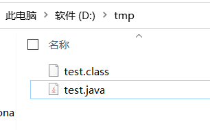
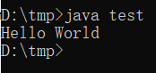
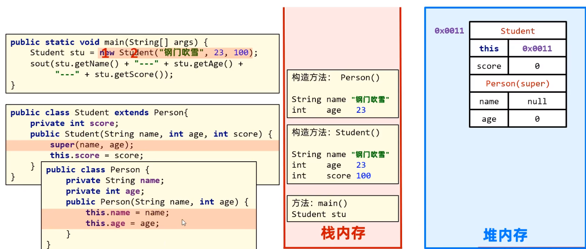
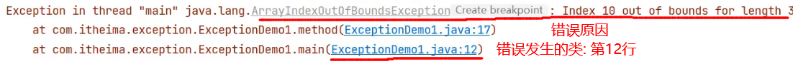
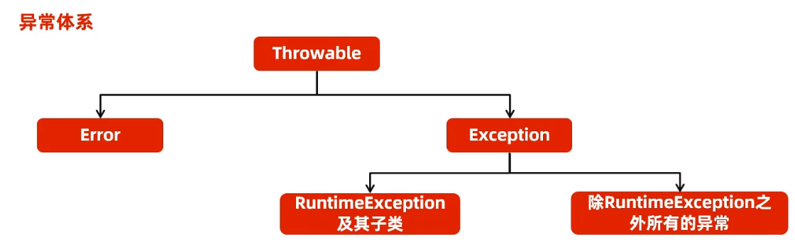

# Java背景

## Java由来

>Java语言是美国**Sun**公司(Stanford Univesity Network)，在1995年推出的计算机语言
>
>之后被**Oracle**收购
>
>**Java之父**：詹姆斯·高斯林(James Gosling)

## Java三大平台

### Java SE

+ Java SE：Java语言的（标准版），用于桌面应用的开发，**是其他两个版本的基础**
+ **桌面应用**：用户只需打开程序，程序的界面会让用户在最短的时间内找到他们所需的功能，同时主动带领用户完成他们的工作
+ 学习Java SE主要还是为之后从事 Java EE 开发，打基础

### Java ME

+ Java ME：Java语言的（小型版），用于嵌入式消费类电子设备的开发

+ **如今已经退出市场**

### Java EE

+ Java 语言的（企业版），用于**Web**方向的网站开发

> **网页**：用于数据的展示
>
> **网站**：网页 + 后台服务器

## Java的跨平台性

+ **平台**：指的是操作系统

> 1. Windows
> 2. MacOS
> 3. Linux

+ 跨平台：Java程序可以在任意操作系统上运行

+ **原理：**

  + 在需要运行Java应用程序的操作系统上，安装一个与操作系统对应的**Java虚拟机**
  + **Java 虚拟机**：JVM (Java Virtual Machine)

  + ==JVM本身不允许跨平台，跨平台的是Java程序==

# 开发步骤

+ 编写 test.java 程序

在`D:\tmp`路径下创建`test.java`文件

```java
public class test{

	public static void main(String [] args){
		System.out.print("Hello World");
	}

}
```

+ 编译`test.java`程序

```shell
javac test.java
```

+ 得到`test.class`文件



+ 运行`test`类

```shell
java test #此时不需要文件拓展名
```




# JDK的组成

+ **JVM (Java Virtual Machine)**： java虚拟机，真正运行java程序的地方
+ **核心类库**：java 自己写好的程序，给程序员的程序调用的
+ **JRE (Java Runtime Environment)**：Java 的运行环境
+ **JDK (Java Development Kit)**：Java 开发工具包（包括以上所有）

# Java基础

## 关键字和字面量

> 字面量：
>
> 在代码中用于表示固定的常量值，它们通常不会在运行时改变。在 Java 中，你可以将字面量直接分配给变量或使用它们在表达式中进行计算.
>
> 关键字：
>
> Java 关键字是一组具有特殊含义和用途的保留字，在 Java 编程语言中有固定的用途，它们通常表示控制结构、数据类型、修饰符等。

例如：

```java
//字面量
int x = 42; // 整数字面量
double pi = 3.14; // 浮点数字面量
char ch = 'A'; // 字符字面量
String message = "Hello, World"; // 字符串字面量
boolean flag = true; // 布尔字面量
String[] colors = {"Red", "Green", "Blue"}; // 数组字面量

//关键字
//abstract, assert, break, byte, case, catch, try 等等
```

## 标识符

+ **标识符**：就是给类、方法、变量命名的符号
+ **命名规则**：
  1. 有数字、字母、下划线、美元符号组成
  2. 不能用数字开头
  3. 不能是关键字
  4. 区分大小写

### 命名规范

+ **小驼峰命名法**（一般用于给**变量**命名）
  1. 标识符是一个单词时，所有字母小写
  2. 标识符包含多个单词时，从第二个单词开始，首字母大写
+ **大驼峰命名法**（一般用于给**类**命名）
  1. 标识符是一个单词时，首字母大写
  2. 标识符包含多个单词时，每个单词首字母都大写


## 数据类型

+ **整数：**`byte, short, long, int`

+ **浮点数：**`float, double`
+ **字符：**`char`
+ **布尔：**`boolean`

## Scanner键盘录入

```java
import java.util.Scanner;	// 导入模块
/*
*   Scanner有多种方法
*   * nextInt()    
*   * nextDouble()
*   * next()        从键盘录入字符串,并使用String类型变量接收
* */
public class test {
    public static void main(String[] args) {
        
        // 除了sc标识符可变，其余部分都固定
        Scanner sc = new Scanner(System.in); 	
        
        //获取输入变量
        int age = sc.nextInt();	
    }
}
```

## 字符串的拼接

```java
public class test {
    public static void main(String[] args) {
        Scanner sc = new Scanner(System.in);
        System.out.println(1 + 23);				//24
        System.out.println(1 + "hello");		//"1hello"
        System.out.println(1 + 2 + "hello");	//"3hello"
        System.out.println("hello" + 1 + 2);	//"hello12"
    }
}
```

## 自增自减运算符

```java
public class test {
    public static void main(String[] args) {
        int a = 1;
        int b = 1;
        System.out.println(++a);	//2
        System.out.println(b++);	//1
    }
}
```

## 类型转换

### 隐式类型转换

+ 把一个**取值范围小**的数值或者变量，复制个另一个**取值范围大**的变量

```java
public class test {
    public static void main(String[] args) {
        int a = 10;
        double b = a;
        System.out.println(b);	//10.0
    }
}
```

+ `byte` `short` `char`在运算过程中，都会先隐式转换为`int`，再进行运算

```java
public class test {
    public static void main(String[] args) {
        byte a = 1;
        byte b = 2;
        //byte c = a + b;	报错，a + b 返回的是 int 类型, 不能赋值给 byte类型
    }
}
```

### 显式类型转换

+ **格式：**目标数据类型 变量名 =  （目标数据类型） 被强转的数据；

```java
public class test {
    public static void main(String[] args) {
        double a = 10.3;
        int b = (int) a;
        System.out.println(b);	//结果输出10, 损失了小数部分
    }
}
```


## 不同进制书写

```java
/*
        计算机中进制的分类:
            * 十进制: 默认
            * 二进制: 0b开头
            * 八进制: 0开头
            * 十六进制: 0x开头
 */
public class test {
    public static void main(String[] args) {
        System.out.println(110);
        System.out.println(0b110);
        System.out.println(0110);
        System.out.println(0x110);
    }
}
```

## 方法调用

+ 方法没有调用时，函数方法在**方法区**中的字节码文件中存放
+ 方法被调用时，需要进入到**栈内存**中运行

+ 方法结束时，会从**栈内存**中弹出

+ ==主方法会在程序执行时，自动先加载进入**栈内存**==

# Java内存分区

+ 堆
+ 栈
+ 方法区
+ 本地方法栈
+ 寄存器

# 数组

## 一维数组

### 静态初始化

```java
public class demo {
    /*
     *   数组介绍: 一种容器, 可以存储多个同种类型的数据
     *   数组的定义格式:
     *       * 方式一:
     *           数据类型[] 数组名;
     *       * 方式二:
     *           数据类型 数组名[];
     *       注意: 这种定义格式, 只是定义出来了而已, 在实际物理内存中并没有该数组
     *
     *   数组的静态初始化:
     *       * 方式一:
     *           数据类型[] 数组名 = new 数据类型[] {元素1, 元素2, ...};
     *       * 方式二:
     *           数据类型[] 数组名 = {元素1, 元素2, ...};
     *
     * */
    public static void main(String[] args) {
        int[] arr1 = {1, 3};
        double[] arr2 = {1.1, 2.2, 3.3};
        /*
        *   打印数组名:
        *       [I@776ec8df
        *       [D@4eec7777
        *
        *       @ : 分隔符
        *       [ : 当前空间, 数组类型
        *       I : 当前数组类型, 是 int 类型
        *       776ec8df : 数组的十六进制内存地址
        *
        * */
        System.out.println(arr1);
        System.out.println(arr2);
    }
}

```

### 动态初始化

```java
public class demo{
    /*
    *   数组的动态初始化:
    *       在初始化时, 只需要指定数组长度, 系统自动分配默认值
    *       格式:
    *           数据类型[] 数组名 = new 数据类型[长度];
    *       默认值的分类:
    *           整数: 0
    *           小数: 0.0
    *           布尔: false
    *           字符: '\u0000'
    *           字符串: null
    *
    * */
    public static void main(String[] args) {
        int[] a = new int[3];
        for(int i = 0;i < a.length;i ++)
            System.out.println(a[i]);
    }
}
```

## 二维数组

### 静态初始化

```java
public class demo{
    public static void main(String[] args) {
        int[][] a = new int[][]{
            {1,2,3}, 
            {4,5,6}, 
            {7,8,9}
        };
        for(int i = 0;i < a.length;i ++) {
            for (int j = 0; j < a[i].length; j++)
                System.out.print(a[i][j]);
            System.out.println();
        }
    }
}
```

### 动态初始化

```java
public class demo{
    public static void main(String[] args) {
        int[][] a = new int[3][3];
    }
}
```

# 对象

+ **父类中的private属性被子类继承后, 子类事实上是继承到了该属性,只是没办法直接访问和修改,需要借助父类中的`public int get()`以及`public void set()`函数来操作private属性**



```java
class Father{
    private int age;
    public Father(){}
    public Father(int age){
        this.age = age;
    }
    public int getAge(){
        return age;
    }
    public void setAge(int age){
        this.age = age;
    }
}

class Son extends Father{
    public Son(){};
    public Son(int age){
        super(age);
    }
}
```

# API

## Object类

+ 所有的类，都直接或间接继承了**Object**类，所有对象（包括数组）都实现了**Object**类的方法

```java
/*
	getClass().getName() : 获取类名称（包名 + 类名）
	Integer.toHexString() : 转十六进制
	hashCode() : 返回的是对象内存地址加哈希算法，计算出的哈希值
*/
public String toString() {
    return getClass().getName() + "@" + Integer.toHexString(hashCode());
}
/*
	Object类中的equals方法，默认比较的是对象的内存地址
	* 通常的会重写equals方法，让对象之间比较的是内容
	
*/
public boolean equals(Object obj){
    return (this == obj);
}
```


## Math类


## System类


==[下面内容详情](D:\project\java_project\relearnJava)==

# 异常

+ **概念**：程序在编译或执行中，出现的错误




+ **异常体系**



## 处理方式

+ **异常默认处理流程**
  1. 虚拟机在出现异常的代码附近，自动创建一个异常对象
  2. 异常会从方法出现的地方抛出给调用者，调用者最终抛出给 **JVM** 虚拟机
  3. 虚拟机接收到异常对象后，现在控制台直接输出异常具体信息
  4. 终止 Java 程序运行，后续代码不会再运行了
+ `try ...catch`

```java
public class demo {
    public static void main(String[] args) {
        try {
            FileReader fileReader = new FileReader("D:\\text.txt");
        }catch (FileNotFoundException e){
            
        }
    }
}
```

+ `throws`

```java
public class demo {
    public static void setAge(int age)/* throws Exception 需要在控制台打印信息，终止程序就写throws*/{
        if(age >= 0 && age <= 120){
            this.age = age;
        }else{
            // 错误年龄, throw 暴露抛出异常
            throw new Exception("年龄范围有误，需要0~120之间的年龄。");
        }
	}
    
    public static void main(String[] args) {
        try{
	    	setAge(10);
        }catch(Exception){
            System.out.println("年龄范围有误，需要0~120之间的年龄。");
        }
    }
}
```

## 自定义异常

+ **自定义异常**
  1. 自定义编译时异常：创建一个类，继承`Exception`类
  2. 自定义运行时异常：创建一个类，继承`RunTimeException`类
+ **细节**
  + ==子类重写父类方法时，不能抛出父类方法没有的异常，或者比父类方法更大的异常==

```java
public class StudentAgeException extends RuntimeException{
    
    public StudentAgeException(){
    }
    
    public StudentAgeException(String message){
        super(message)
    }
}
```


# 抽象类

+ **抽象类**: 特殊的父类

+  **抽象方法**: 父类中只做出方法声明, 而不会实现具体的方法体, 继承了父类的子类则必须实现父类中的抽象方法, 否则编译错误
+ **注意事项**:
  1. **抽象类不能实例化**
     + **原因**: 因为抽象方法没有实现, 不能真的调用, 所有实例化抽象类没有意义
  2. **抽象类存在构造方法**
     + **原因**: 子类需要用super访问父类的属性和方法
  3. **抽象类中可以存在普通方法**
  4. **子类必须实现抽象父类的抽象方法, 否则就把子类也定义为抽象类**
  5. **abstract和static, final, private不能共存**
     + **原因**:
       1. static方法可以通过类名调用, 但是抽象方法根本没有实现              
       2. final方法不允许子类重写, 但是abstract方法要求子类必须重写, 二者冲突
       3. private不允许子类重写, 但是abstract方法要求子类必须重写, 二者冲突

# 接口类

+ **接口**: 为代码制定规范
+ **特点**:
  1. 定义一个抽象类, 其中所有方法都是抽象方法, 没有成员属性和普通方法
  2. 接口不能实例化, 因为它包含抽象方法
  3. 接口类是没有构造方法的
  4. 接口类中的成员属性, 系统会自动添加pblic, static, final修饰符
  5. 接口类中的成员方法, 系统会默认添加public, abstract修饰符
  6. 接口类允许子类进行多实现, 即子类可以同时继承并实现多个接口
  7. 接口类允许另一个接口类继承并且可以多继承


# 代码块

+ **概念**：使用`{}`括起来的代码，就是代码块
+ **分类：**
  1. **局部代码块**
     + 位置：方法中的一对花括号
     + 作用：限定变量的生命周期，提早释放内存
  2. **构造代码块**
     + 位置：类中方法外的一对花括号
     + 特点：在创建对象执行构造方法之前，就会执行构造代码块
     + 补充：构造代码块中的代码会在编译生成class字节码文件之后，全部分散到各个构造方法中去，**每个构造方法第一段代码都是构造代码块中的代码**，==即构造代码块就是抽取每个构造方法中相同的代码，达到简化代码的目的==
  3. **静态代码块**
     + 位置：类中方法外的一对花括号，需要加入`static`关键字
     + 特点：随着类的加载而执行，因为类只会加载一次，所以也就执行一次
     + 作用：对类内的静态数据进行初始化


# 内部类

+ **定义**：内部类就是定义在类中的类

```java
class Outer{
    class Inner{
        
    }
}
```

+ **创建对象格式**

```java
class Outer{
    class Inner{
        public int num = 10;
    }
}

public class Demo{
    public static void main(String[] args){
        Outer.Inner oi = new Outer().new Inner();
        System.out.println(oi.num);
    }
}
```

+ **成员访问细节**
  1. 内部类中，访问外部类成员，**可以直接访问，包括私有**
  2. 外部类中，访问内部类成员，**需要创建对象，进行访问**

```java
class Outer{
    //外部类的num属性
    public int num = 10;

    //访问内部类的num属性
    Inner tmp = new Inner();
    public void show(){
        System.out.println(tmp.num);
    }
    
    class Inner{
        public int num = 20;
        public void show(){
            int num = 30;

            System.out.println(num); 			//30
            System.out.println(this.num);		//20
            System.out.println(Outer.this.num);	//10
        }
    }
}

public class Demo{
    public static void main(String[] args){
        //创建内部类
        Outer.Inner oi = new Outer().new Inner();
        System.out.println(oi.num);
        
        System.out.println("---------------");
        
        //创建外部类
        Outer outer = new Outer();
        outer.tmp.show();
    }
}
```

+ **内部类的分类**

  1. **成员内部类**
     + 上述代码
  2. **静态内部类**

  ```java
  //注意静态只能访问静态
  class Outer{    
      static class Inner{
          public int num = 10;
      }
  }
  
  public class Demo{
      public static void main(String[] args){
          Outer.Inner oi = new Outer.Inner();
          System.out.println(oi.num);
      }
  }
  ```

  3. **局部内部类**(鸡肋)

  ```java
  //注意静态只能访问静态
  class Outer{
      
      public void show{
          class Inner{
              public int num = 10;
          }
          
          Inner inner = new Inner();
          System.out.println(inner.num);
      }
      
  }
  
  public class Demo{
      public static void main(String[] args){
          Outer outer = new Outer();
          outer.show();
      }
  }
  ```

  

  4. **匿名内部类**
     + 概述：匿名内部类本质上是一个特殊的局部内部类
     + 前提：**需要存在一个接口或类**
     + **格式**：
       1. `new 类名 () {}`: 表示继承这个类
       2. `new 接口名 () {}`: 表示实现这个接口

   ```java
  interface Inter{
      void show();
  }
  
  
  public class AnonymousInnerClass {
      public static void main(String[] args) {
          //method();需要传参
          method(new Inter() {
              @Override
              public void show() {
                  System.out.println("这是匿名内部类的接口实现");
              }
          });
      }
      public static void method(Inter i){
          i.show();
      }
  }
   ```
  


# Lambda表达式

+ **简介**：JDK8 开始后的一种新的语法形式
+ **作用**：简化匿名内部类的书写规则
+ **局限**：**只能简化函数式编程的接口**（接口有且只有一个抽象方法）

## Lambda表达式的省略写法

+ 参数类型可以省略
+ 如果只有一个参数，参数类型可以省略，同时（）也可以省略
+ 如果Lambda表达式的方法体代码只有一行代码，可以省略大括号不写，同时要省略分号，此时，如果这行代码是return语句，必须省略return不写，同时也必须省略分号不写

==idea有快捷方式，将匿名内部类转换成Lambda语法==

# 内部类和Lambda区别

+ **使用限制不同**
  1. 匿名内部类：可以操纵类、接口
  2. Lambda表达式：只能操作函数式接口
+ **实现原理不同**
  1. 匿名内部类：编译后，产生单独的`.class`字节码文件
  2. Lambda表达式：编译后，没有单独的`.class`字节码文件

# 设计模式

## 适配器设计模式

+ **适配器设计模式**：解决接口和接口实现类之间的矛盾（有时候接口实现类可能只需要实现接口的部分抽象方法，而不是全部抽象方法）
+ **实现步骤：**
  1. 编写一个`xxxAdapter`类，实现对应接口（空实现）
  2. 使用新的类继承`xxxAdapter`类，并实现自己所需要的方法
  3. 注意：为了避免`xxxAdapter`类被创建对象，需要使用`abstract`进行修饰

## 模板设计模式

+ **模板设计模式**：将抽象类整体看作一个模板，模板中不能决定的方法定义成抽象的，让使用模板的类（继承模板的类）来重写抽象方法实现需求
+ 总之，模板设计模式定义了通用结构，使用者只需要关注自己需要实现的需求即可