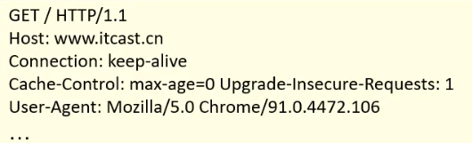
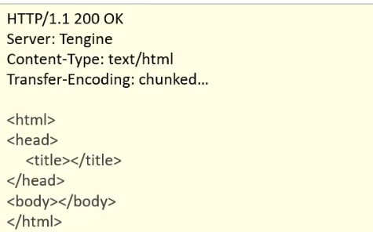

# HTTP

+ 概念：Hyper Text Transfer Protocol 超文本传输协议
+ 协议特点：
  1. 基于**TCP**协议：面向连接、安全
  2. 基于请求-响应模型的：一次请求对应一次响应
  3. HTTP协议时无状态的协议：对于事务处理没有记忆能力。每次请求-响应都是独立的
     + 缺点：多次请求间无法共享数据
     + 优点：快

# 请求数据格式

+ 请求数据分三部分
  1. 请求行：请求数据第一行。**GET**表示请求方式，**/**表示请求资源路径，**HTTP/1.1**表示协议版本
  2. 请求头：第二行开始，格式为**key：value**形式
  3. 请求体：**POST**请求的最后一部分

+ 常见的**HTTP**请求头：
  1. **Host**：请求的主机名
  2. **User-Agent**：浏览器版本，例如Chrome浏览器的标识类似`Mozilla/5.0`
  3. **Accept**：表示浏览器能接受的资源类型，如text/*，image/*或者\*/*表示所有
  4. **Accept-Language**：表示浏览器偏好的语言，服务器可以据此返回不同语言的网页
  5. **Accept-Encoding**：表示浏览器可以支持的压缩类型，例如gzip、deflate

# 响应数据格式

+ 响应数据分为三部分：

  1. 响应行：响应数据的第一行。其中HTTP/1.1表示协议版本，200表示响应状态码，ok表示状态码描述
  2. 响应头：第二行开始，格式为**key：value**形式
  3. 响应体：最后一部分，存放响应数据

  

+ 常见的**HTTP**响应头：
  1. **Content-Type**：表示该协议内容的类型，例如text/html，image/jpeg
  2. **Content-Length**：表示该响应内容的长度（字节数）
  3. **Content-Encoding**：表示该响应压缩算法，例如gzip
  4. **Cache-Control**：表示客户端如何缓存，例如`max-age=300`表示最大可以缓存300秒

