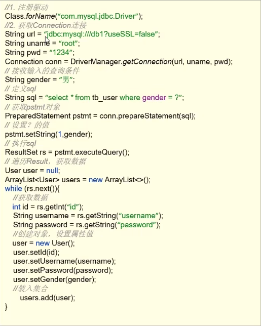

# JDBC简介

**概念:**

+ **JDBC**就是使用**JAVA**语言操作关系型数据库的一套**API**
+ 全程: (Java DataBase Connectivity) Java 数据库连接

**本质:**

+ 官方(sun公司)定义的一套操作所有关系型数据库的规则,即**接口**
+ 各个数据库厂商去实现这些接口,提供数据库驱动**jar包**
+ 我们可以使用这套接口(**JDBC**)编程, 真正执行的代码是驱动**jar包**中实现的类

**优点:**

+ 各个数据库厂商使用相同接口, Java代码不需要针对不同数据库分别开发
+ 可随时替换底层数据库, 访问数据库的Java代码保持基本不变




# DriverManager

+ 功能: 获取连接
+ 参数:
  + url: 连接路径
    1. 语法: jdbc:mysql://127.0.0.1:3306/数据库名?键值对1&键值对2
    2. jdbc:mysql://127.0.0.1:3306/st?useSSL=false
    3. 细节: 如果连接的是本地mysql服务器,且端口为默认3306,则url中IP地址和端口号可省略
  + user: 用户名
  + password: 密码

```java
//获取Connection对象
Connection conn = DriverManager.getConnection(url, username, password);
```


# Connection

+ 功能: 管理事务, 获取**SQL**的对象

**管理事务**

```java
//开启事务
setAutoCommit(bolean autoCommit); //参数为true为自动提交事务,false为手动
//提交事务
commit();
//回滚事务
rollback();
```

```java
String url = "jdbc:mysql://127.0.0.1:3306/st";
String username = "root";
String password = "root";
Connection conn = DriverManager.getConnection(url, username, password);

//定义sql
String sql = "select * from sc";

//获取执行sql的对象statement
Statement stmt = conn.createStatement();
try{
    //开启事务
    conn.setAutoCommit(false);
    //执行sql
    int count = stmt.executeUpdate(sql);
    System.out.println(count);
    //提交事务
    conn.commit();
}catch (Exception throwables) {
    //回滚事务
    conn.rollback();
    throwables.printStackTrace();
}
```

# Statement

+ 功能: 执行**SQL**语句

1. `int executUpdate(sql)`执行**DML, DDL**语句

   **返回值**

   1. DML语句影响的行数
   2. DDL语句执行后,执行成功可能返回0

2. `ResulSet executQuery(sql)`执行**DQL**语句

   **返回值**

   1. ResultSet结果集对象

```java
Statement stmt = conn.createStatement();
stmt.executeQuery(sql);
stmt.executeUpdate(sql);
```

# ResultSet

+ 功能: 

  1. 封装了**DQL**查询语句的结果

     ```java
     ResultSet stmt.executeQuery(sql);
     ```

  2. 获取查询结果

     ```java
     boolean next();//将光标从当前位置向前移动一行
     //返回值true, 有效行,当前行结束
     //返回值false, 无效行,当前行没有数据
     ```

# PreparedStatement

+ 功能: 防止**SQL**注入

**获取PreparedStatement对象**

```java
String sql = "select * from user where username = ? and password = ?";
PreparedStatement pstmt = conn.prepareStatement(sql);
//不同于conn.createStatement();这里在创建PreparedStatement对象时,直接传入sql字符串
```

**设置sql字符串中的占位符**

```java
pstmt.setString(1, name);
pstmt.setString(2, password);
```

**执行sql**

```java
ResultSet rs = pstmt.executeQuery();
```

# 数据库连接池

+ 优点
  1. 资源复用
  2. 提升系统响应速度
  3. 避免数据库连接遗漏
+ 常见数据库连接池
  1. DBCP
  2. C3P0
  3. Druid (阿里巴巴开源)

**Druid**

```java
//1.导入jar包

//2.配置文件

//3.加载配置文件
Properties prop = new Properties();
prop.load(new FileInputStream("配置文件本地路径"));

//4.获取连接池对象
DataSource dataSource = DruidDataSourceFactory.createDataSource(prop);

//5.获取数据库连接connection对象
Connection conn = dataSource.getConne
```

