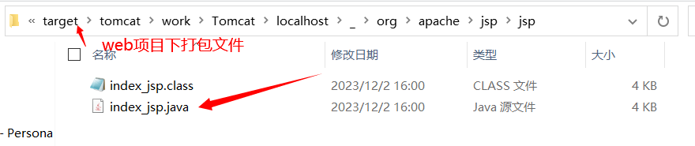
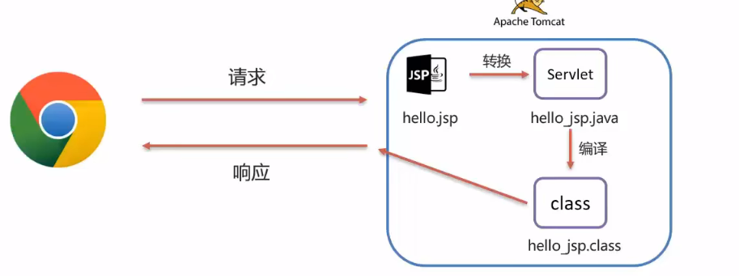
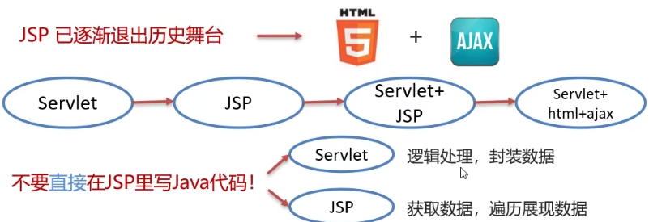
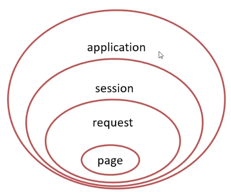
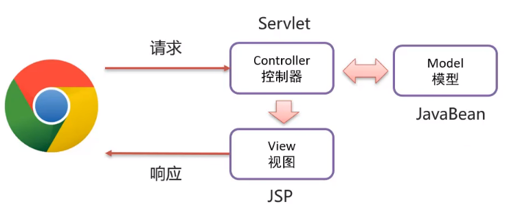
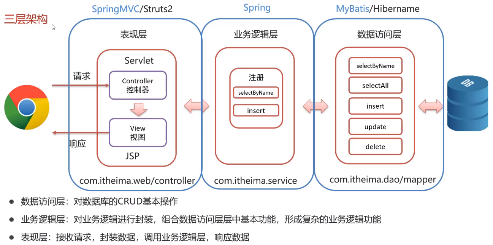
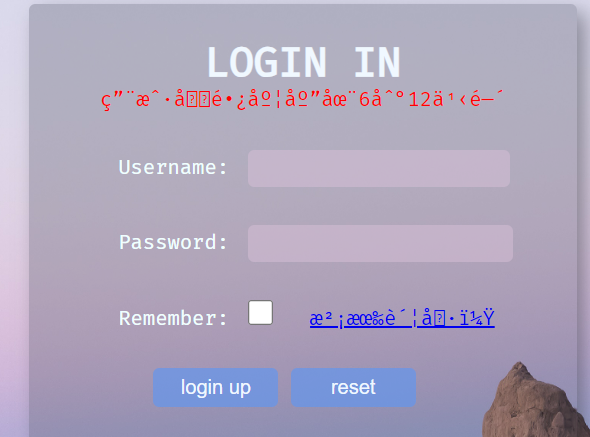

# 基础概念

+ JSP: Java Server Pages, Java 服务端页面
+ 一种动态的网页技术, 其中既可以定义HTML, JS, CSS等静态内容, 还可以定义 JAVA代码的动态内容
+ JSP = HTML + Java
+ JSP的作用: 简化开发, 避免了在 Servlet 中直接输出 HTML 标签或者拼接字符串

# 快速入门

1. <font color='green'>导入JSP坐标</font>

```xml
<dependency>
    <groupId>javax.servlet.jsp</groupId>
    <artifactId>jsp-api</artifactId>
    <version>2.2</version>
    <scope>provided</scope>
</dependency>
```

2. <font color='green'>创建JSP文件</font>

3. <font color='green'>编写HTML标签</font>

```html
<%@ page contentType="text/html;charset=UTF-8" language="java" %>
<html>
<head>
    <title>Title</title>
</head>
<body>
    
<h1>Hello World!</h1>

</body>

</html>

```


# 基本原理

+ JSP本质上就是一个 Servlet
+ JSP在被访问时, 由JSP容器(tomcat)将其转化为JAVA文件(Servlet), 再由tomcat将其编译,最终对外提供服务的就是这个java字节码文件





# JSP脚本

+ JSP脚本用于在JSP页面内定义Java语句
+ JSP脚本分类:
  1. `<%  %>`: 内容会直接放到 _jspService() 方法中去
  2. `<%= %>`: 内容会放到 out.print() 中, 作为其参数
  3. `<%! %>`: 内容会放到 _jspService() 方法之外, 被类直接包含(作为成员包含)

# 🎁动作标识

## 操作 JavaBean

+ 创建 JavaBean 示例并设置 JavaBean 个属性的值

  1. id 用于指定创建的 JavaBean 实例的实例名, 其值应为合法的 Java 标识符
  2. scope 指定 JavaBean 的有效范围, 对应`page, request,session,application`四个值
  3. class 用于指定一个完整的类名,包括该类所在的包路径
  4. type
  5. beanName

  ---

  6. name 指定一个 JSP 范围内的 JavaBean 实例
  7. property 指定 name 内的一个属性
  8. value 给指定的 property 赋值, 若没有指定 param 则可以使用 value
  9. param 给指定的 property 赋值, param 是 request 的一个参数

```jsp
<jsp:useBean id="user" scope="page" class="com.wgh.UserBean" type="com.wgh.UserBean">
    <jsp:setProperty name="user" property="*"/>
</jsp:useBean>
<%=user.getName()%>
<jsp:getProperty name="user" property="name"> //获取user实例的name属性
```

+ 请求转发

```jsp
<jsp:forward page="url">
    <jsp:param name="参数名" value="值"/> //相当于设置request参数
</jsp:forward>
```

# 转发和重定向

```jsp
<%-- 请求转发 --%>
<jsp:forward page="url">
    <jsp:param name="参数名" value="值"/> //相当于设置request参数
</jsp:forward>
<%-- 重定向 --%>
<%
	response.setHeader("refresh", "5;URL=login.jsp");
%>
```


# JSP缺点

+ 书写麻烦
+ 可读性差
+ 复杂度高
+ 占用内存大
+ 调试困难
+ 不利于团队协作, 前端不会java, 后段不会HTML, 但又在同一个代码里协作

==JSP已经烂了, 退出历史舞台==



# EL表达式

+ EL表达式: Expression Language 表达式语言, 用于简化 JSP 页面的 Java 代码

+ 功能: 获取数据

+ 语法: `${expression}`

  获取域(request域)中存储的 key 为 expression 的数据

+ JavaWeb的四大域对象:

  1. page: 当前页面有效
  2. request: 当前请求有效
  3. session: 当前会话有效
  4. application: 当前应用有效

  <font color='red'>EL表达式获取数据, 会依次从四个域总寻找, 直到找到为止</font>

  

  

# JSTL标签

+ JSP 标准标签库(Jsp Standard Tag Library), 使用标签取代 JSP 页面上的 Java 代码

```jsp
<c:if test="${flag == 1}">
    男
</c:if>
<c:if test="${flag == 2}">
    女
<c:forEach items="${users}" var="user">
    <div>
        ${user.username}
    </div>
</c:forEach>
```

+ 需要导包

1. 导入 Maven 坐标

```xml
<dependency>
    <groupId>jstl</groupId>
    <artifactId>jstl</artifactId>
    <version>1.2</version>
</dependency>
<dependency>
    <groupId>taglibs</groupId>
    <artifactId>standard</artifactId>
    <version>1.1.2</version>
</dependency>
```

2. 在 JSP 页面上引入 JSTL 标签库

```jsp
<%@ taglib prifix="c" uri="http://java.sun.com/jsp/jstl/core"  %>
```

3. 使用`<c:if>`

<font color='red'>示例程序</font>

```java
package com.itheima.web.request;
import com.itheima.mapper.UserMapper;
import com.itheima.pojo.User;
import com.itheima.util.SqlSessionFactoryUtils;
import org.apache.ibatis.session.SqlSession;

import javax.servlet.*;
import javax.servlet.http.*;
import javax.servlet.annotation.*;
import java.io.IOException;
import java.util.List;

@WebServlet(name = "demo7", value = "/demo7")
public class ServletDemo7 extends HttpServlet {
    @Override
    protected void doGet(HttpServletRequest request, HttpServletResponse response) throws ServletException, IOException {
        //1. 获取sqlSession对象
        SqlSession sqlSession = SqlSessionFactoryUtils.getSqlSessionFactory().openSession();
        //2. 获取UserMapper对象, 操作数据库
        UserMapper userMapper = sqlSession.getMapper(UserMapper.class);
        List<User> users = userMapper.selectAll();
        //3. 释放资源
        sqlSession.close();
        //4. 设置request请求属性, 发起请求转发给/jsp/index.jsp
        request.setAttribute("users", users);
        request.getRequestDispatcher("/jsp/index.jsp").forward(request, response);
    }

    @Override
    protected void doPost(HttpServletRequest request, HttpServletResponse response) throws ServletException, IOException {
        this.doGet(request, response);
    }
}
```

```jsp
<%@ page import="java.util.Random" %>
<%@ taglib uri="http://java.sun.com/jsp/jstl/core"   prefix="c"%>
<%@ page contentType="text/html;charset=UTF-8" language="java" %>
<html>
<head>
    <title>Title</title>
</head>
<body>
<h1>Hello World!</h1>

<c:forEach items="${users}" var="user">
    <div>
        ${user.username}
    </div>
</c:forEach>
</body>

</html>

```


# MVC模式和三层架构

+ MVC 是一种分层开发的模式

  1. M; Model, 业务模型
  2. V; View, 视图, 页面展示
  3. C; Controller, 控制器, 处理请求, 调用模型和视图

+ MVC 优点

  1. 指责单一, 互不影响
  2. 利于分工协作
  3. 利用组件重用

  






# 问题

## JSP中标签内容显示乱码



<font color='orange'>解决方法</font>

```jsp
<%@ page contentType="text/html; charset=UTF-8" %>
```

**设置页面编码：** 在 JSP 页面的头部添加上述代码来设置页面的字符编码

