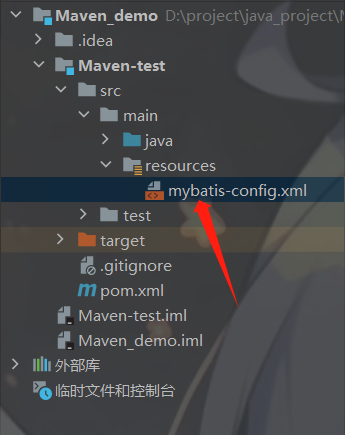
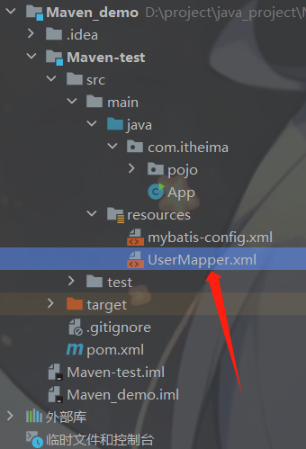
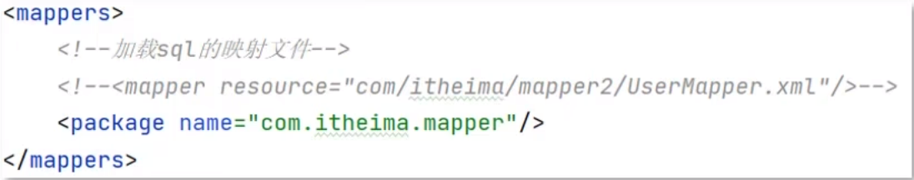
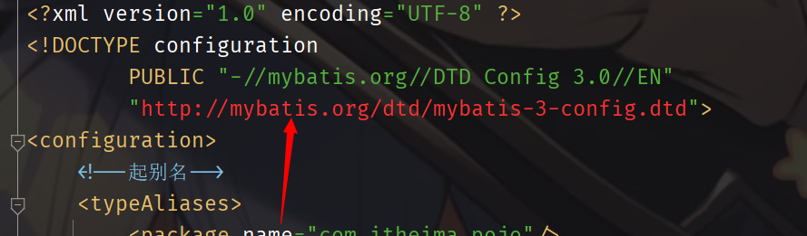
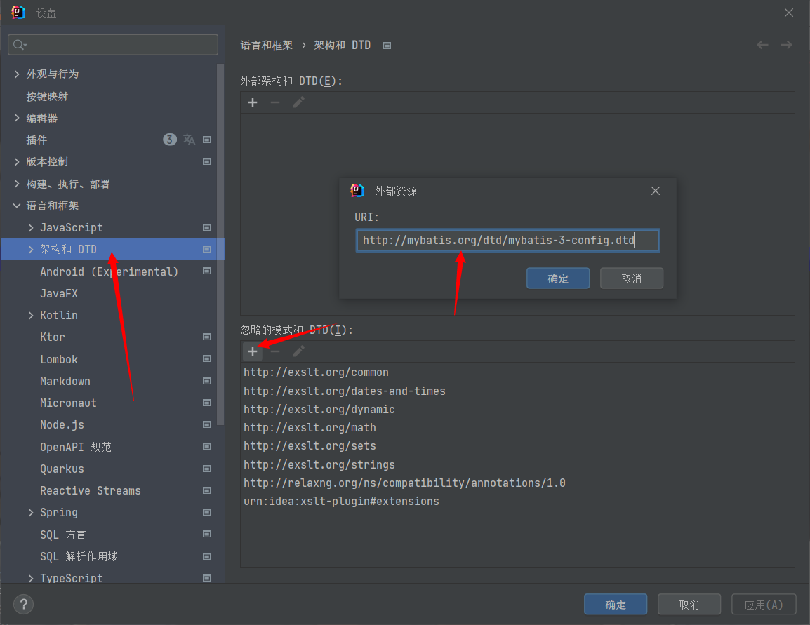
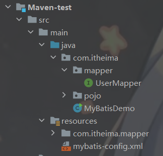
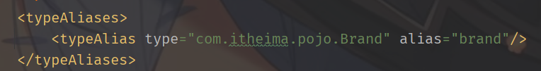
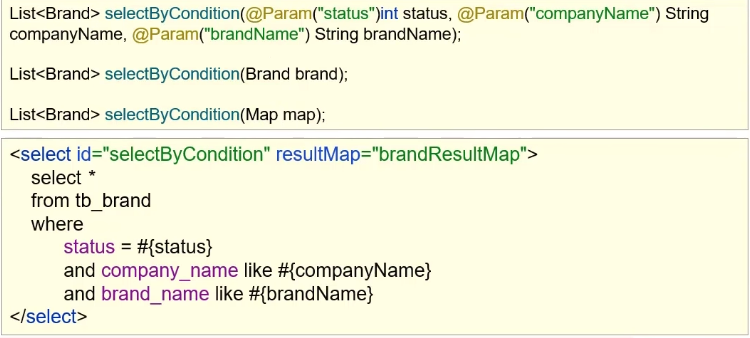
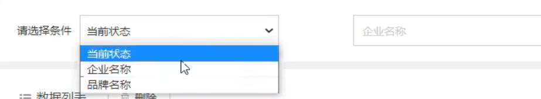

# MyBatis简介

+ **什么是MyBatis?**

1. MyBatis 是一款优秀的**持久层框架**，用于简化**JDBC**开发

2. MyBatis 本是 Apache 的一个开源项目iBatis，2010年这个项目由apache software foundation 迁移到了Google code，并且改名成Mybatis，2013年11月迁移到GitHub

3. [官网]:https://mybatis.org/mybatis-3/zh/index.html

+ **持久层是什么？**

1. 负责将数据保存到数据库的那一层代码
2. **JavaEE**三层架构：表现层，业务层，持久层

+ **框架**

1. 框架是一个半成品软件，是一套可重用的、通用的、软件基础代码模型
2. 在框架的基础之上构建软件编写更加高效、规范、通用、可扩展

+ **简化JDBC**

1. 将**JDBC**中的硬编码转化为配置文件，方便修改
2. 将**JDBC**中的sql语句，也放入配置文件

# 快速了解

## 导入mybatis依赖

```xml
<dependency>
    <groupId>org.mybatis</groupId>
    <artifactId>mybatis</artifactId>
    <version>3.5.5</version>
</dependency>
```

## 创建mybatis基础结构

1. 创建`user`表，添加数据

>在数据库中操作，创建user表

```mysql
create database mybatis;
use mybatis;
drop table if exists tb_user;

create table tb_user(
    id int primary key auto_increment,
    username varchar(20),
    password varchar(20),
    gender char(1),
    addr varchar(30)
);

insert into tb_user values(1, '张三', '123', 'M', '北京');
insert into tb_user values(null, '李四', '234', 'F', '天津');
insert into tb_user values(null, '王五', '11', 'M', '西安');
```


2. 创建模块，导入坐标

创建`mybatis-config.xml`配置文件



并在`mybatis-config.xml`配置文件中写入

```xml
<?xml version="1.0" encoding="UTF-8" ?>
<!DOCTYPE configuration
        PUBLIC "-//mybatis.org//DTD Config 3.0//EN"
        "http://mybatis.org/dtd/mybatis-3-config.dtd">
<configuration>
    <!-- 起别名, 给com.itheima.pojo下所有实体类起别名 -->
    <typeAliases>
        <package name="com.itheima.pojo"/>
    </typeAliases>

    <environments default="development">
        <environment id="development">
            <transactionManager type="JDBC"/>
            <dataSource type="POOLED">
                <property name="driver" value="com.mysql.cj.jdbc.Driver"/>
                <property name="url" value="jdbc:mysql:///web_demo?useSSL=false&amp;useServerPrepStmts=true"/>
                <property name="username" value="root"/>
                <property name="password" value="root"/>
            </dataSource>
        </environment>
    </environments>
    <mappers>
        <!--扫描mapper-->
        <package name="com.itheima.mapper"/>
    </mappers>
</configuration>
```

构建SQL映射文件`UserMapper.xml`

==一般操作什么表，就叫什么Mapper==




1. 编写**MyBatis核心配置文件**，替换链接信息，解决硬编码
2. 编写**SQL映射文件**，统一管理sql语句，解决硬编码
3. 编码
   1. 定义**POJO类**
   2. 加载核心配置文件，获取**SqlSessionFactory对象**
   3. 获取**SqlSession**对象，执行SQL
   4. 释放资源


# 入门

+ 定义与SQL映射文件同名的**Mapper**接口文件，并且将**Mapper**接口和SQL映射文件放置在同一个路径下

> 解释：一般sql查询会返回一个结果集合，在java程序中，我们将该结果集的单个元素定义为一个实体类，并在项目中定义一个接口用于规范和定义所有操作目标实体类的抽象方法。而具体的sql语句会定义在与接口同名的映射文件（xml文件）中。

<font color='green'>下面给出一个简单示例</font>

<font color='green'>接口文件</font>

```java
package com.itheima.mapper;

import com.itheima.pojo.User;
import org.apache.ibatis.annotations.Param;

import java.util.List;

public interface UserMapper {

    List<User> selectAll();//定义一个抽象方法
}
```

<font color='green'>映射文件（包含具体的sql语句）</font>

```xml
<?xml version="1.0" encoding="UTF-8" ?>
<!DOCTYPE mapper
        PUBLIC "-//mybatis.org//DTD Mapper 3.0//EN"
        "http://mybatis.org/dtd/mybatis-3-mapper.dtd">

<!-- namespace: 命名空间 -->
<mapper namespace="com.itheima.mapper.UserMapper">
    <!-- id需要与接口文件中的相关方法同名, resultType指定了返回的类型(这里用) -->
    <select id="selectAll" resultType="com.itheima.pojo.User">
        select * from tb_user;
    </select>
</mapper>
```


+ 设置SQL映射文件的namespace属性为**Mapper**接口全限定名
+ 在Mapper接口中定义方法，方法名就是SQL映射文件中sql语句的**id**，并保持参数类型和返回值类型一致
+ 编码：
  1. 通过**SqlSession**的`getMapper`方法获取Mapper接口的代理对象
  2. 调用对应的方法完成sql执行

> **细节：**
>
> 如果Mapper接口名称和SQL映射文件名称相同，并在同一目录下，则可以使用包扫描的方法简化SQL映射文件的加载




MyBatis 是一个用于简化数据库访问的开源持久层框架，它通过 XML 或注解的方式将 Java 对象映射到数据库表。以下是 MyBatis 的基础使用方法：

### 步骤 1: 引入 MyBatis 依赖

首先，需要在项目中引入 MyBatis 的依赖，如果使用 Maven，可以在 `pom.xml` 文件中添加：

```xml
<dependencies>
    <!-- MyBatis 核心库 -->
    <dependency>
        <groupId>org.mybatis</groupId>
        <artifactId>mybatis</artifactId>
        <version>3.x.x</version>
    </dependency>

    <!-- MyBatis 和数据库交互的驱动库，如使用 MySQL -->
    <dependency>
        <groupId>mysql</groupId>
        <artifactId>mysql-connector-java</artifactId>
        <version>8.0.23</version> <!-- 替换为你的 MySQL 驱动版本 -->
    </dependency>
</dependencies>
```

### 步骤 2: 配置 MyBatis XML 文件

创建 MyBatis 的配置文件（如 `mybatis-config.xml`）：

```xml
<!-- mybatis-config.xml -->
<configuration>
    <!-- 数据库环境配置 -->
    <environments default="development">
        <environment id="development">
            <!-- 使用 JDBC 连接数据库 -->
            <transactionManager type="JDBC"/>
            <!-- 配置数据源 -->
            <dataSource type="POOLED">
                <property name="driver" value="com.mysql.cj.jdbc.Driver"/>
                <property name="url" value="jdbc:mysql://localhost:3306/your_database"/>
                <property name="username" value="your_username"/>
                <property name="password" value="your_password"/>
            </dataSource>
        </environment>
    </environments>

    <!-- 映射器配置，指定 Mapper 文件的位置 -->
    <mappers>
        <mapper resource="com/example/mapper/YourMapper.xml"/>
    </mappers>
</configuration>
```

### 步骤 3: 创建 Mapper 接口和 XML 文件

创建一个 Java 接口用于定义 SQL 映射，以及一个对应的 XML 文件，用于编写 SQL 语句。例如：

```java
// YourMapper.java
package com.example.mapper;

import com.example.model.YourModel;

public interface YourMapper {
    YourModel selectById(int id);
}
```

```xml
<!-- YourMapper.xml -->
<mapper namespace="com.example.mapper.YourMapper">
    <select id="selectById" resultType="com.example.model.YourModel">
        SELECT * FROM your_table WHERE id = #{id}
    </select>
</mapper>
```

### 步骤 4: 使用 MyBatis

在 Java 代码中使用 MyBatis 进行数据库操作：

```java
public class YourService {
    public static void main(String[] args) {
        // 加载 MyBatis 配置文件
        String resource = "mybatis-config.xml";
        InputStream inputStream = Resources.getResourceAsStream(resource);
        SqlSessionFactory sqlSessionFactory = new SqlSessionFactoryBuilder().build(inputStream);

        // 获取 SqlSession
        try (SqlSession sqlSession = sqlSessionFactory.openSession()) {
            // 获取 Mapper 接口的代理对象
            YourMapper yourMapper = sqlSession.getMapper(YourMapper.class);

            // 调用 Mapper 方法进行数据库操作
            YourModel yourModel = yourMapper.selectById(1);
            System.out.println(yourModel);
        }
    }
}
```

这是一个简单的 MyBatis 基础使用的示例。具体的 SQL 语句和数据表结构需要根据实际情况进行调整。在实际应用中，可能还需要使用事务管理、处理多表关联查询等更高级的功能。


# 常见问题

## mybatis-config.xml爆红

+ 问题描述



+ 解决方案

将该 url 添加到如下配置中



# 注意事项



+ 观察项目目录结构，**resources**目录下除了`mybatis-config.xml`配置文件外，其余的都是**Mapper代理**配置文件，可以将**Mapper代理**的路径设置成与源代码目录下**Mapper接口**一致的路径，方便**Maven**进行编译


+ 如下代码是**SQL映射文件**示例

```xml
<?xml version="1.0" encoding="UTF-8" ?>
<!DOCTYPE mapper
        PUBLIC "-//mybatis.org//DTD Mapper 3.0//EN"
        "https://mybatis.org/dtd/mybatis-3-mapper.dtd">
<mapper namespace="com.itheima.mapper.UserMapper">
	<!-- id是sql语句的唯一标识， resultType是返回值类型，可以在mybatis-config.xml中设置别名 -->
    <select id="selectAll" resultType="com.itheima.pojo.User">
        select * from tb_user;
    </select>
    <select id="selectById" resultType="com.itheima.pojo.User">

    </select>

</mapper>
```




+ 这是`mybatis-config.xml`文件中对返回值类型取别名的示例， 其中`type`属性是**mapper代理**的源代码路径，`alias`**是别名**

# 查询

+ **查看行(参数为主键id)**

需要在SQL映射文件中的SQL语句中传入参数

```xml
<!-- 
	参数占位符：
	1. #{}: 会将所在位置替换为'?', 为了防止sql注入
	2. ${}: 拼sql, 存在sql注入的风险
	3. 使用时机:
		* 参数传递时用#{}
		* 表名或者列名不固定的情况下: ${} 会有sql注入的f'x
	4. 特殊字符处理
		* 小于号 $lt (转义字符)
		* CDATA区
-->
<select id="selectById" resultMap="brandResultMap">
        select *
        from tb_brand where id = #{id};
</select>
```

+ **多条件查询**



+ **动态SQL**

1. **多条件动态查询**


```xml
<!-- 用于判断参数是否有值 test属性进行条件判断 -->
<if>
    
</if>
<!-- 自动替换sql语句中的where -->
<where>
    
</where>

<!--示例-->
<select id="selectByCondition" resultMap="brandResulMap">
    select *
    from tb_brand
    <where>
        <if test="status != null">
            and status = #{status}
        </if>
        <if test="companyName != null and companyName != '' ">
            and company_name like #{companyName}
        </if>
        <if test="brandName != null and brandName != ''">
            and brand_name like #{brandName}
        </if>
    </where>
</select>
```

2. **单条件动态查询**



```xml
<select id="selectByCondition" resultMap="brandResulMap">
    select *
    from tb_brand
    <choose>
        <when test="status != null">
            status = #{status}
        </when>
        <when test="companyName != null and companyName != '' ">
            company_name like #{companyName}
        </when>
        <when test="brandName != null and brandName != ''">
            brand_name like #{brandName}
        </when>
        <!--也可以选择使用where将choose标签全部包裹起来,就不需要otherwise了-->
        <otherwise> 
            1 = 1
        </otherwise>
    </choose>
</select>
```

3. **添加**

```xml
<!--添加函数-->
    <insert id="add" ke>
        insert into tb_brand 
        (id, brand_name, company_name, ordered, description, status)
        values 
        (#{id}, #{brandName}, #{companyName}, #{ordered}, #{description}, #{status});
    </insert>
```

4. **修改**

修改全部字段

```xml
<update id="update">
        update tb_brand
        set
            brand_name = #{brandName},
            company_name = #{companyName},
            ordered = #{ordered},
            description = #{description},
            status = #{status}
        where id = #{id};
</update>
```

动态修改

```xml
<!--修改函数-->
    <update id="update">
        update tb_brand
        <set>
            <if test="status != null">
                status = #{status},
            </if>
            <if test="companyName != null and companyName != '' ">
                company_name = #{companyName},
            </if>
            <if test="brandName != null and brandName != ''">
                brand_name = #{brandName},
            </if>
            <if test="ordered != null">
                ordered = #{ordered},
            </if>
            <if test="description != null and description != ''">
                description = #{description},
            </if>
            <if test="id != null">
                id = #{id}
            </if>
        </set>
        where #{id} = id;
</update>
```

5. 删除

动态删除

```xml
<!--动态删除函数-->
    <delete id="deletByIds">
        delete from tb_brand
        where id
        in (
            # mybatis会将数组参数封装为一个Map集合
            /*
            * 默认: array = 数组
            * 使用@Param注解可以改变map集合的默认key的名称
            */
            <foreach collection="array" item="id" separator=",">
                #{id}
            </foreach>
                  );
    </delete>
```

