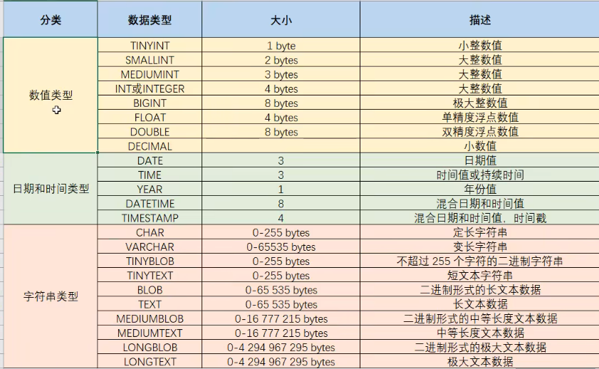
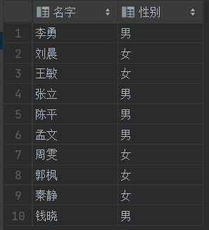
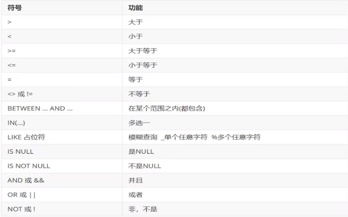
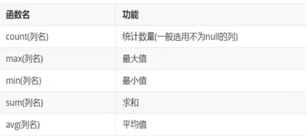
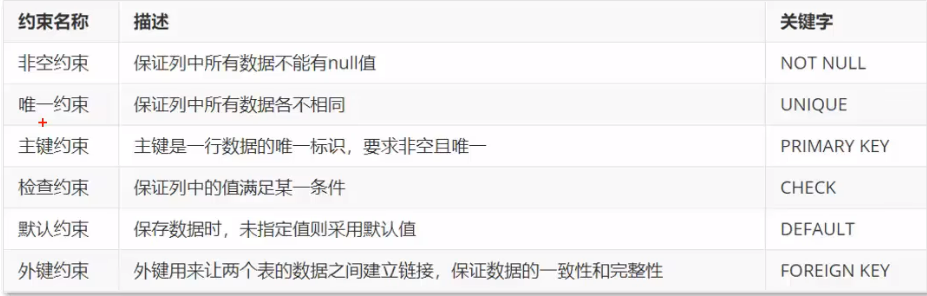

# 序


数据库 DatBase (DB)

数据库管理系统 DateBasse Management Syetem (DBMS)

SQL--->DBMS--->DB

==MySQL 端口号默认3306==

==password root==

添加环境变量

> 启动MySQl
>
> cmd --->  mysql -u root -p

# 数据库操作

==SQL语言分类==

1. DDL、Date Definition Language
2. DML、Date Manipulation Language
3. DQL、Date Query Language
4. DCL、Date Control Language

## 数据类型



> DOUBLE类型	例如: score double(5.2)  表示score总长度为5,保留2位小数


## DDL

+ 展示数据库列表

```mysql
show databases;
```

+ 创建数据库

```mysql
create database [if not exist] 数据库名 [default charset] [collate]
drop 数据库名称 [if exist] 数据库名称

#例如
create database if not exist test; #不存在test 就创建test
create database default charset utf-8mb4; #设置字符集

drop dababase if exists test; #存在test 就删除他
```

+ 删除数据库

```mysql
drop 数据库名称 if exit 数据库名称
```

+ 展示当前所处数据库

```mysql
select database(); #查询当前处于哪个数据库
```

+ 跳转到目标数据库

```mysql
use 数据库名; #跳转到其他数据库
```

+ 查询当前数据库内的所有关系表

```mysql
show tables;
```

+ 展示表结构

```mysql
desc 表名; 
```

+ 查询指定表的建表语句

```mysql
show create table 表名; 
```

+ 创建表

```mysql
create table 表名(
	字段1 字段1类型 [COMMENT 字段1注释],
	字段2 字段2类型 [COMMENT 字段2注释],#注意逗号分隔
	.....
	字段n 字段n类型 [COMMENT 字段n注释]#最后一个无逗号结尾
)[#表 注释]
```

```mysql
#举例
    create table tu_user(
        id int comment '编号',
        name varchar(50) comment '姓名',
        age int comment '年龄',
        gender varchar(1) comment '性别'
    )comment '用户表'
```

+ 各种修改操作

```mysql
alter table 表名 add 字段名 类型 [comment]; #添加字段(列)
alter table 表名 modify 字段名 新数据类型 [comment];# 修改数据类型
alter table 表名 change 旧字段名 新字段名 类型 [comment]; #修改字段名和类型

alter table 表名 drop 字段名; #删除字段(列)
alter table 表名 rename to 新表名; #修改表名

drop table [if exists] 表名; #删除表
truncate table 表名; #删除指定表，再重新创建该表，相当于清空数据
rollback; # 回滚mysql数据库
```


## DML

+ 给指定字段添加数据

```mysql
insert into 表名 （字段1，字段2) values (值1，值2，);
# 给所有字段添加数据, 括号内的字段列表是可以省略的
# 例如
insert into stu (id, name, sex) values(2,'李四','男')
#等价于
insert into stu values(2,'李四','男')
```

+ 修改字段的值

```mysql
update 表名 set 字段1=值1,字段2=值2 where 条件;		#无where 则修改全部数据
#例如
update admin_login_k set admin_name = 'wx' while id = 1;
```

+ 删除行

```mysql
delete from 表名 where 条件; #删除表内某些满足条件的
```


## DQL

+  基础查询

```mysql
select 字段名 from 表名 where 条件列表
```

==去除重复的字段值==

```mysql
select distinct 字段名 from 表名 where 条件列表
```

```mysql
# as 作为关键字可以对字段取别名, as 可以省略
# 例如
select sname 名字, ssex as 性别 from student;
```




+ 条件查询



```MySQL
# 举例
select * from stu where age = 20; # SQL查询语句中一个等号就代表等值关系
select * from stu where age != 20;
select * from stu where age >= 20 and age <= 30;
select * from stu where age between 20 and 30;
select * from stu where age in (18,20,30);
select * from stu where score is null; # 查询所有score字段为空的行
```

```mysql
# 查询姓王的行
select * from stu where name like '王%';
# 查询名字第二个字是花的行
select * from stu where name like '_花%';
# 查询名字包含'建'字的行
select * from stu where name like '%建%';
```

+ 排序查询

```mysql
select * from stu order by age; # 按照年龄升序排序查询
select * from stu order by age desc; # 按照年龄降序排序查询
#查询结果按照 math 降序排列, 如果 math 相同则按照 english 升序排序
select * from stu order by math desc, english asc;
```

+ 分组查询

​																				**聚合函数**



==注意null值不参与所有聚合函数的运算==

```mysql
# 统计表中一共有多少行
select count(sno) from stu; # 注意count(字段)只能统计字段不为空的行
select count(*) from stu;
# 查询数学成绩的最高分
select max(math) from stu;
# 查询数学成绩最低分
select min(math) from stu;
# 查询数学成绩平均分
select avg(math) from stu;
# 查询数学成绩总分
select sum(math) from stu;
```

+ 分组查询

```mysql
# 分组查询男女同学的数学平均分
select sex, avg(math) from stu group by sex;
# 分组查询男女同][学的人数
select sex, count(*) from stu group by sex;
# 查询男女同学的数学平均分,要求70分以下的不参与分组
select sex, avg(math) from stu where math >= 70 group by sex;
# 查询男女同学数学平均分,要求分组内人数要大于2人
select sex, avg(math) from stu group by sex having count(*) > 2;
```

+ 分页查询

```mysql
# 从第0行开始,展示3条数据
select * from stu limit 0, 3;
# 从第3行开始,展示3条数据
select * from stu limit 3, 3;
```

> + limit语句只能再MySQL数据库中使用
>
> + Oracle分页查询使用 rownumber
> + SQL Server 分页查询使用 top

# 约束


> **概念:**
>
> 约束是作用于表中列上的规则,用于限制加入表的数据,保证数据库中数据的**正确性, 有效性, 完整性**



```mysql
# 举例
create table stu (
    id int primary key auto_increment,# 主键,自增长
    sname varchar(15) not null unique,# 非空, 唯一
    joindate date not null,
    sdept varchar(15) default 'SC' # 默认为字符串'SC'
);
```

==注意默认约束下,不指定字段值系统会自动赋值默认值,但是指定为NULL,则还是NULL==

```mysql
alter table 表名 alter 字段 set default; #添加默认约束
alter table 表名 modify 字段 数据类型 not null; #添加非空约束
alter table 表名 modify 字段 数据类型 unique; #添加唯一约束
alter table 表名 modify 字段 数据类型 primary key; #添加主键约束
#删除约束
alter table 表名 modify 字段 数据类型;
```

1. **查看约束信息：**

- **查看表的所有索引：**

  ```sql
  SHOW KEYS FROM table_name;
  ```

```
  - **查看特定索引的详细信息：**
  ```sql
  SHOW KEYS FROM table_name WHERE Key_name = 'idx_column_name';
```

2. **强制使用或忽略索引：**

+ 外键约束

<font color='orange'>取名规范: fk\_当前表名\_外键表名</font>

```mysql
#创建表时添加外键约束
create table 表名 (
    id int,
    constraint 外键名 foreign key(字段) references 主表(字段)
);
#删除外键
alter table emp drop foreign key 外键名;
#添加外键
alter table emp add constraint 外键名 foreign key(字段) references 主表(字段)
```

>==注意==
>
>删除父表需要先将子表中包含外键的行删除


# 索引

## 原理

索引的实现原理可以简单概括为数据库系统使用一种数据结构来提高数据的检索速度。不同的数据库系统可能使用不同的实现方式，但主要的索引结构<font color='orange'>包括 B 树（或 B+ 树）、哈希索引、全文索引</font>等。以下是其中两种常见的索引结构的简要说明：

1. **B 树（或 B+ 树）索引：**
   - **B 树（或 B+ 树）结构：** B 树是一种平衡树结构，它具有良好的平衡性，节点的数据项按顺序排列。在 B+ 树中，非叶子节点只包含指向子节点的索引，而叶子节点包含实际的数据项。B+ 树通常比 B 树更适合数据库索引，因为它更好地利用了磁盘块的大小，叶子节点形成一个有序链表，方便范围查询。
   
- **搜索过程：** 通过 B+ 树索引进行搜索时，从根节点开始，根据节点上的索引值选择下一个要访问的节点，直到到达叶子节点。在叶子节点上，可以找到指向实际数据的指针。
  
- **插入和删除：** 插入和删除操作涉及到树的调整，确保树的平衡性。这可能包括分裂节点、合并节点、调整索引等操作。
  
2. **哈希索引：**

   - **哈希函数：** 哈希索引使用哈希函数将索引列的值映射到一个固定大小的哈希码。这个哈希码可以用作在哈希表中查找存储实际数据的位置。

   - **搜索过程：** 当执行搜索时，数据库系统通过哈希函数计算出要查找的值的哈希码，然后直接跳转到哈希表中的对应位置。如果发生哈希冲突，通常会采用链地址法或开放地址法来解决。

   - **插入和删除：** 插入和删除操作可能需要重新计算哈希码，并进行相应的调整以处理哈希冲突。

> <font color=#7cfc>选择使用哪种类型的索引通常取决于具体的使用场景、数据分布情况以及查询需求。在实际应用中，数据库系统可能还会使用组合索引、全文索引等不同的索引类型以满足不同的需求。</font>

## 使用

在 MySQL 中，常用的索引操作<font color='orange'>包括创建索引、删除索引、查看索引信息以及使用不同类型的索引</font>。以下是一些常见的索引操作及相应的示例：

1. **创建索引：**

   - **单列索引：**
     
     ```sql
     CREATE INDEX idx_column_name ON table_name (column_name);
     ```
   ```
     
   - **多列索引：**
     
     ```sql
     CREATE INDEX idx_multi_columns ON table_name (column1, column2);
   ```

   - **唯一索引：**
     ```sql
     CREATE UNIQUE INDEX idx_unique_column ON table_name (column_name);
     ```

   - **全文索引（仅适用于支持全文索引的存储引擎）：**
     ```sql
     CREATE FULLTEXT INDEX idx_fulltext_column ON table_name (column_name);
     ```

2. **删除索引：**

   ```sql
   DROP INDEX idx_column_name ON table_name;
   ```

3. **查看索引信息：**

   - **查看表的所有索引：**
     
     ```sql
     SHOW INDEX FROM table_name;
     ```
   ```
     
   - **查看特定索引的详细信息：**
     ```sql
     SHOW INDEX FROM table_name WHERE Key_name = 'idx_column_name';
   ```

4. **强制使用或忽略索引：**

   - **使用索引：**
     ```sql
     SELECT * FROM table_name USE INDEX (idx_column_name) WHERE column_name = 'value';
     ```

   - **忽略索引：**
     ```sql
     SELECT * FROM table_name IGNORE INDEX (idx_column_name) WHERE column_name = 'value';
     ```

   - **强制重新分析索引：**
     ```sql
     ANALYZE TABLE table_name;
     ```

# 视图

在 MySQL 中，可以使用 `CREATE VIEW` 语句来创建视图。视图是虚拟的表，其内容是从一个或多个基本表中导出的。视图可以简化复杂的查询，提高查询的可维护性和可重用性。以下是创建视图的基本语法：

```sql
CREATE VIEW view_name AS
SELECT column1, column2, ...
FROM table_name
WHERE condition;
```

具体来说：

- `view_name` 是你为视图指定的名称。
- `column1, column2, ...` 是你希望在视图中包含的列。
- `table_name` 是视图基于的表。
- `condition` 是可选的，它定义了从基本表中选择哪些行。

例如，假设有一个名为 `employees` 的表，你想要创建一个只包含部分列的视图：

```sql
CREATE VIEW employee_names AS
SELECT employee_id, first_name, last_name
FROM employees
WHERE department_id = 10;
```

这样，你就创建了一个名为 `employee_names` 的视图，其中包含了 `employees` 表中部门编号为 10 的员工的部分列。

之后，你可以像查询表一样查询视图：

```sql
SELECT * FROM employee_names;
```

需要注意的是，视图不存储实际的数据，而是在查询时动态地生成。因此，当基础表的数据发生变化时，通过视图查询的结果也会相应地反映这些变化。

另外，如果你需要更新视图，可以使用 `CREATE OR REPLACE VIEW` 语句，或者使用 `ALTER VIEW` 语句来修改视图的定义。

# 数据库设计

+ **表关系**
  + **一对多**
    + 如: 部门表 和 员工表
    + 实现方式: 由**多**的一方建立外键, 链接另一方的主键
  + **多对多**
    + 如: 订单 和 商品, 一个商品对应多个订单, 一个订单包含多个商品
    + 实现方式: **建立第三张中间表**, 其中至少包含两个外键, 分别关联双方主键
  + **一对一**
    + 如: 用户 和 用户详情
    + 实现方式: 将原来的表拆分成两个表, 在其中一个里添加**主键(并设置唯一约束)**关联另一方

# 多表查询

+ 连接查询

  + 内连接

  ```mysql
  #隐式内连接
  select * from emp, dept where emp.id = dept.id;
  #显示内连接
  select * from emp [inner] join dept on emp.id = dept.id;
  ```

  + 外连接

  ```mysql
  #左外连接
  select * from emp left join dept on emp.id = dept.id;
  #右外连接
  select * from emp right join dept on emp.id = dept.id;
  ```

  

+ 子查询

**查询中嵌套子查询**

1. 子查询结果**单行单列**

   ```mysql
   # 可以使用 !=, >, <符号替换下列查询中的等号'='
   select 字段列表 from 表名 where 字段名 = (子查询);
   ```

2. 子查询结果**多行单列**

   ```mysql
   # 子查询作为条件值, 使用in关键字进行条件判断
   select 字段列表 from 表名 where 字段名 in (子查询);
   ```

3. 子查询结果**多行多列**

   ```mysql
   #子查询作为虚拟表
   select 字段列表 from (子查询) where 条件;
   ```

# 存储过程

> **概念**:
>
> ​	MySQL存储过程是一组预编译的SQL语句，它们被命名并存储在数据库中，可以通过单一的调用执行。存储过程通常包含控制流语句（例如IF、CASE）、循环语句（例如WHILE、FOR）、SQL语句和其他PL/SQL（Procedural Language/Structured Query Language）元素，使得可以执行更复杂的数据库操作。

下面是一些关于MySQL存储过程的常见操作：

1. **创建存储过程：**
   使用`CREATE PROCEDURE`语句来创建存储过程。以下是一个简单的示例：

   ```sql
   DELIMITER //
   CREATE PROCEDURE GetEmployee(IN employee_id INT)
   BEGIN
       SELECT * FROM employees WHERE id = employee_id;
   END //
   DELIMITER ;
   ```

2. **调用存储过程：**
   使用`CALL`语句调用存储过程。以下是一个调用上述存储过程的示例：

   ```sql
   CALL GetEmployee(101);
   ```

3. **修改存储过程：**
   使用`ALTER PROCEDURE`语句可以修改存储过程的定义。例如：

   ```sql
   DELIMITER //
   ALTER PROCEDURE GetEmployee(IN employee_id INT, IN department_id INT)
   BEGIN
       SELECT * FROM employees WHERE id = employee_id AND department = department_id;
   END //
   DELIMITER ;
   ```

4. **删除存储过程：**
   使用`DROP PROCEDURE`语句删除存储过程。例如：

   ```sql
   DROP PROCEDURE IF EXISTS GetEmployee;
   ```

5. **查看存储过程：**
   使用`SHOW CREATE PROCEDURE`语句可以查看存储过程的定义。例如：

   ```sql
   SHOW CREATE PROCEDURE GetEmployee;
   ```

存储过程的主要优势之一是可以减少网络流量，因为你只需发送存储过程的调用而不是多个SQL语句。此外，存储过程还可以提高代码的封装性和可维护性，因为逻辑可以在数据库中集中管理。


# 事务

+ 数据库的**事务(Transaction)**是一种机制,一个操作序列,包含了**一组数据库操作命令**
+ **事务**把所有命令作为一个整体, 一起向系统**提交**或**撤销**操作请求,
+ **事务**是一个不可分割的工作单元逻辑

```mysql
# 开始事务
start transaction; # 或者bigin;
# .....具体查询修改语句


# 提交事务
commit; # 将事务的修改持久化到数据库

# 回滚事务
rollback;
```

>**事务的四大特征**
>
>+ 原子性(**A**tomicty): 事务时不可分割的最小操作单位,要么同时成功,要么同时失败
>+ 一致性(**C**onsistency): 事务完成时,必须使得所有数据处于一致状态
>+ 隔离性(**I**solation): 多个事务之间, 操作可见
>+ 持久性(**D**urability): 事务一旦提交或者回滚, 其改变时永久性的


