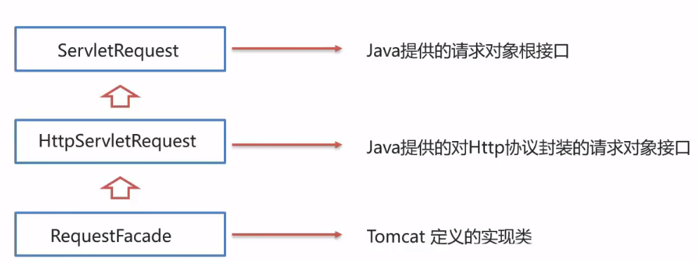
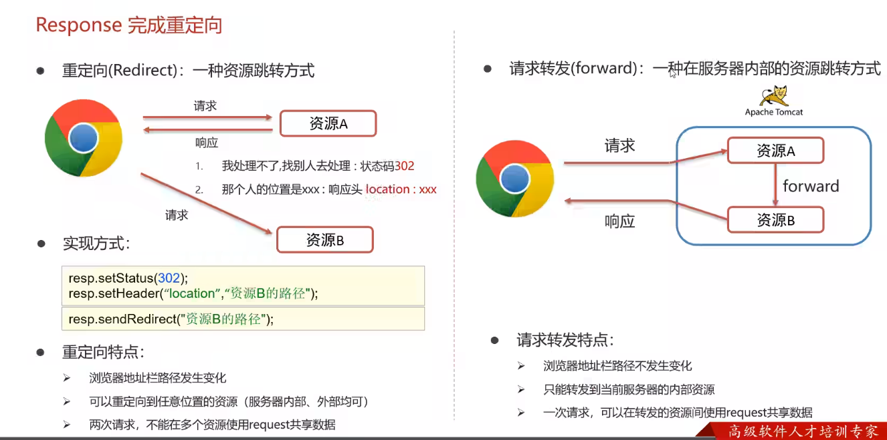
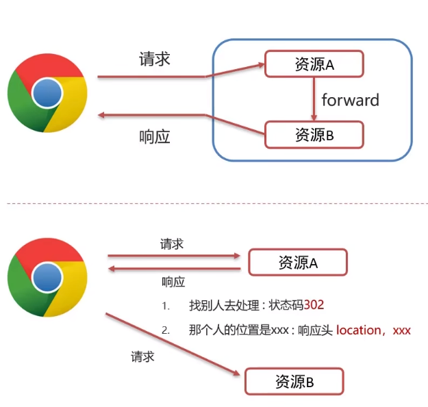

# Request

## 继承体系




## 获取请求数据

+ 请求数据分为3部分

  1. **请求行**

     `GET /myWeb_Web_exploded/demo4 HTTP/1.1`

     + `String getMethod()`: 获取请求方式
     + `String getContextPath()`: 获取虚拟目录(项目访问路径)
     + `StringBuffer getRequestURL()`: 获取**URL**(统一资源定位符)
     + `String getRequestURI()`: 获取**URI**(统一资源标识符)
     + `String getQueryString()`: 获取请求参数(**get方式**)

  2. **请求头**

     `User-Agent: Mozilla/5.0 (Windows NT 10.0; Win64; x64) AppleWebK`

     + `String getHeader(String name)`: 根据请求头名称, 获取值

  3. **请求体**

     `username=superbabay&password=123`

     + `ServletInputStream getInputStream()`: 获取字节输入流
     + `BufferedTeader getReader()`: 获取字符输入流

>==注意:==
>
>post 请求和 get 请求在获取请求参数时采用不同的方式获取数据
>
>post:	使用`BufferedReader`对象获取字符流, 再 `String line = br.readLine()`从而获取数据
>
>get:	使用`String queryString = req.getQueryString()`直接读取数据

### 获取参数的方法

```java
request.getParamet("username");//获取id=username的参数,通常该参数只有一个
request.getParameterValues("hobby");//获取id=hobby的参数,通常由多个value值不同的参数
request.getParameterMap();//返回所有参数的map集合(Map<String, String[]>)
```

```java
package com.itheima.web;

import javax.servlet.ServletException;
import javax.servlet.annotation.WebServlet;
import javax.servlet.http.HttpServlet;
import javax.servlet.http.HttpServletRequest;
import javax.servlet.http.HttpServletResponse;
import java.io.BufferedReader;
import java.io.IOException;

@WebServlet("/demo4")
public class ServletDemo4 extends HttpServlet {
    @Override
    protected void doGet(HttpServletRequest req, HttpServletResponse resp) throws ServletException, IOException {
        // String getMethod(): 获取请求方式: GET
        String method = req.getMethod();
        System.out.println(method);

        // String contextPath = req.getContextPath(): 获取虚拟目录(项目访问路径)
        String contextPath = req.getContextPath();
        System.out.println(contextPath);

        // StringBuffer req.getRequestURL(): 获取统一资源定位符
        StringBuffer url = req.getRequestURL();
        System.out.println(url);

        // String getRequestURI(): 获取统一资源标识符
        String uri = req.getRequestURI();
        System.out.println(uri);

        // String getQueryString(): 获取请求参数
        String queryString = req.getQueryString();
        System.out.println(queryString);
    }

    @Override
    protected void doPost(HttpServletRequest req, HttpServletResponse resp) throws ServletException, IOException {
        //获取post请求体; 请求参数

        //1. 获取字符输入流
        BufferedReader br = req.getReader();
        //2. 读取数据
        String line = br.readLine();
        System.out.println(line);
    }
}
```

### 中文乱码处理

**POST**

+ 使用`request.setCharacterEncoding("UTF-8")`设置字符编码

```java
package com.itheima.web;
/*
 *   @author: qwqcoder
 *   @date:   2023/11/28
 *   @Description:  todo 解决get请求方式,读取中文参数发生乱码的问题
 **/


import javax.servlet.*;
import javax.servlet.http.*;
import javax.servlet.annotation.*;
import java.io.IOException;

@WebServlet(name = "demo5", value = "/ServletDemo5")
public class ServletDemo5 extends HttpServlet {
    @Override
    protected void doGet(HttpServletRequest request, HttpServletResponse response) throws ServletException, IOException {
        //1. 设置字符编码集🔥
        request.setCharacterEncoding("UTF-8");

        //2. 获取数据
        String username = request.getParameter("username");
        System.out.println(username);
    }

    @Override
    protected void doPost(HttpServletRequest request, HttpServletResponse response) throws ServletException, IOException {
        this.doGet(request, response);
    }
}

```

**GET**

+ 如果浏览器发送get请求体,被tomcat服务器使用**ISO-8859-1**方式编码,则中文会出现乱码
+ 使用`new String(String.getBytes("ISO-8859-1"),"UTF-8");`进行解码,再编码


## 请求转发

+ **请求转发**(forward): 一种再服务器内部的资源跳转
+ **实现方式**: `req.getRequestDispatcher("资源B路径").forward(req,resp);`

+ **请求转发资源间共享数据**: 使用 Request 对象
  + `void setAttribute(String name, Object o)`: 存储数据到 request 域中
  + `Object getAttribute(String name)`: 根据 key , 获取值
  + `void removeAttribute(String name)`: 根据 key, 删除该键值对


# Response

## 设置响应数据功能介绍

+ 响应数据分为3部分

  1. **响应行**: `HTTP/1.1 200 ok`

     `void setStatus(int sc)`: 设置响应状态码

  2. **响应头**: `Content-Type: text/html`

     `void setHeader(String name, String value)`: 设置响应头键值对

  3. **响应体**: `<html><head></head><body></body></html>`

     `PrintWriter getWriter()`: 获取字符输出流

     `ServletOutputStream getOutputStream()`: 获取字节输出流


## 完成重定向

+ **重定向(Redirect)**: 一种资源跳转方式

+ **实现方式**:

  ```java
  //1. 第一种方式
  response.setStatus(302);
  response.setHeader("Location", "/myWeb/resp2");//参数1固定, 参数2为重定向虚拟路径
  
  //2. 第二种方式
  response.sendRedirect("/myWeb/resp2");
  ```

  

## 响应字符数据

+ 使用:

  1. 通过 Response 对象获取字符输出流

     `PrintWriter writer = resp.getWriter();`

  2. **写数据**(根据配置的响应头, 浏览器可以解析输出的数据)

     `writer.write("aaa")`

+ ==注意==

  1. 字符输出流可以不用关闭, 随着响应结束自动释放

  2. 中文数据乱码(写数据乱码): 原因是通过 Response 获取的字符输出流默认编码为: **ISO-8859-1**

     `resp.setContentType("text/html;charset=utf-8");`

## 响应字节数据

+ 使用:

  1. 通过 Response 对象获取字符输出流

     `servletOutputStream outputStream = resp.getOutputStream();`

  2. 写数据

     `outputStream.write(字节数据);`

## 注意事项

在HTTP响应中，通常情况下，要么输出文本内容（字符数据），要么输出二进制数据，而不建议混合使用。这是因为HTTP响应头中的`Content-Type`字段会指定响应的类型，而这个类型一般只能是一种，例如，<font color=0xffff>`text/html` 表示HTML文本，`image/png` 表示PNG格式的图片。</font>

如果你先输出了文本内容，后来又尝试输出二进制数据，可能导致HTTP响应头的`Content-Type`字段出现混淆，这可能导致不正确的渲染或处理。

如果你需要在同一个HTTP响应中既包含文本内容又包含二进制数据，一种可行的方式是将二进制数据嵌入到文本内容中，比如将图片的二进制数据使用Base64编码后嵌入HTML文本。这样，你就只需要使用`PrintWriter`来输出整个HTML文本。

```java
PrintWriter writer = response.getWriter();
writer.write("<html>");
writer.write("<body>");
writer.write("<p>欢迎使用resp3</p>");
writer.write("<p>其他文本内容...</p>");
writer.write("");
writer.write("</body>");
writer.write("</html>");
```

请注意，上述代码中的`...base64-encoded-binary-data...`应该替换为实际的Base64编码后的二进制数据。这样，整个响应就包含了文本内容和嵌入的二进制数据。

# 重定向与请求转发



# 虚拟目录问题

+ **明确路径是由谁来使用**:
  + 浏览器使用: 需要添加虚拟目录(项目访问路径)
  + 服务器使用: 不需要添加虚拟目录



```java
//重定向代码, 由浏览器发起新的request请求, 需要添加虚拟目录
protected void doGet(HttpServletRequest request, HttpServletResponse response) throws ServletException, IOException {
        System.out.println("resp1");
        response.setStatus(302);
    	//🔥"myWeb/resp2"
        response.setHeader("Location", "/myWeb/resp2");
        response.sendRedirect("/myWeb/resp2");
    }
```

