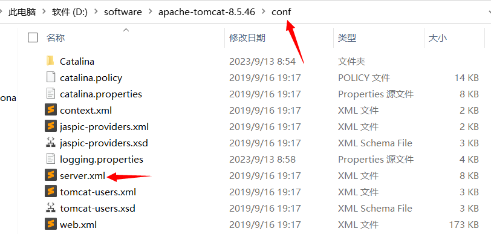
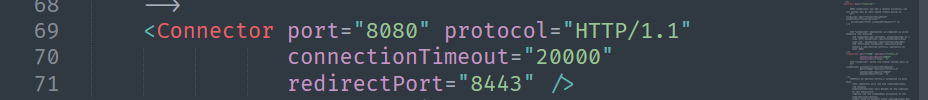
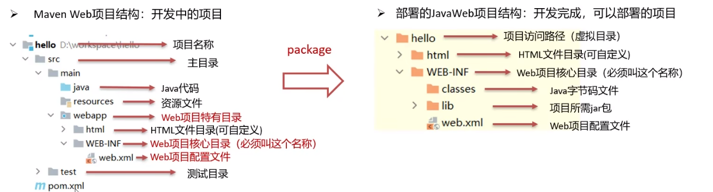
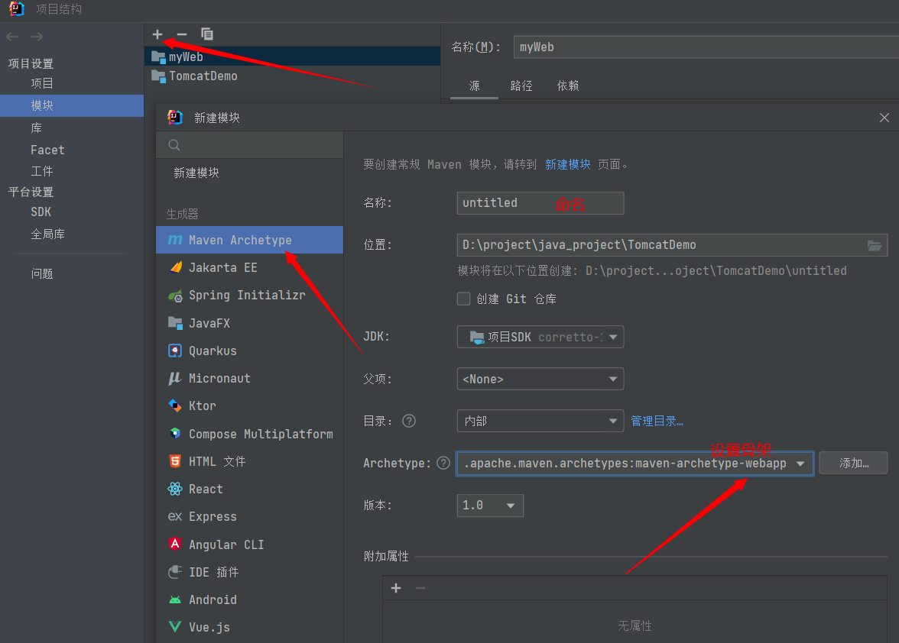
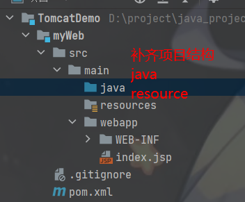
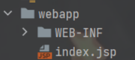
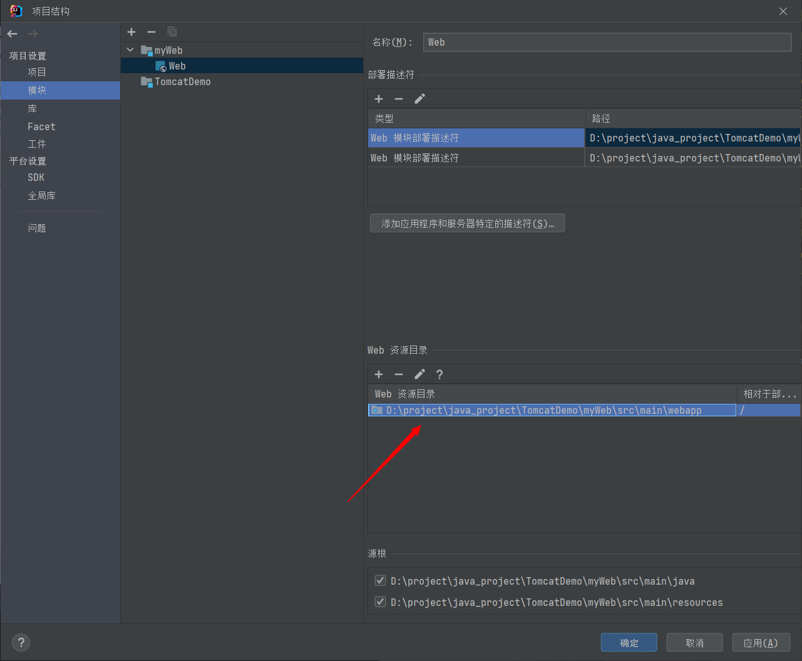
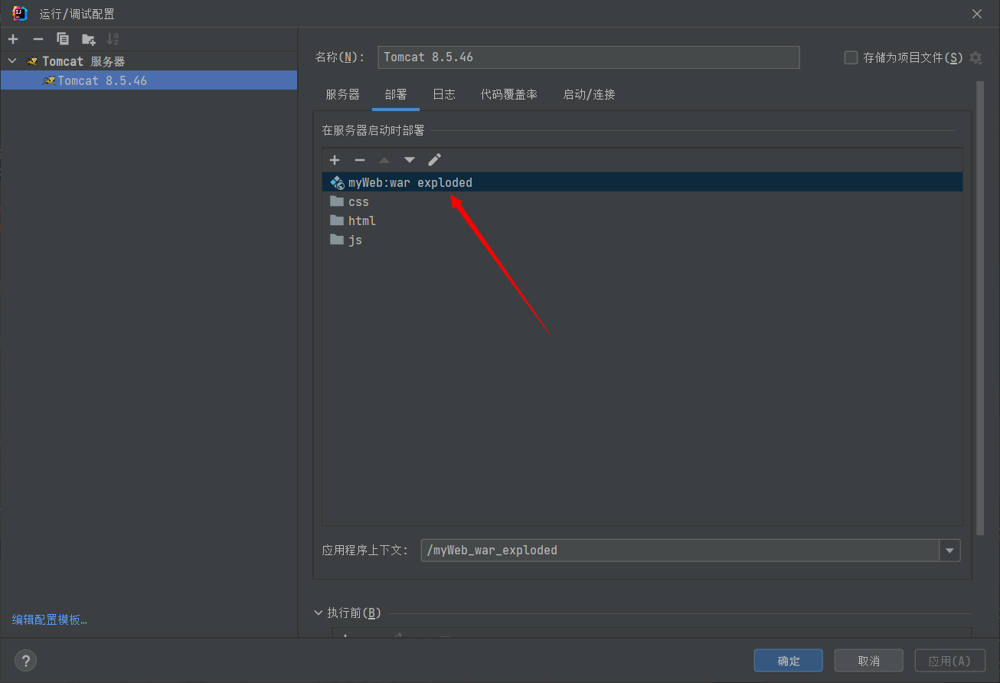
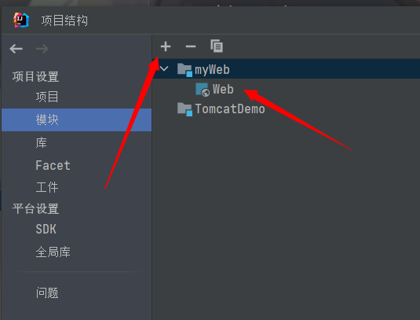
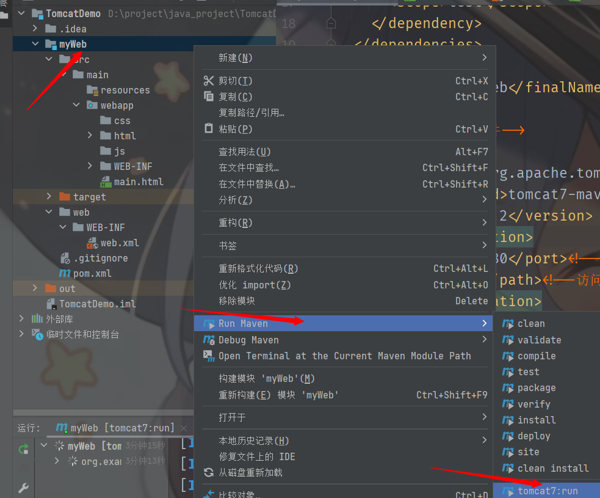

# 简介

+ **概念**：Tomcat是Apache 软件基金会的核心项目，是**开源买免费的轻量级Web服务器**，支持**Servlet/JSP**少量JavaEE规范

+ **Web服务器**：Web服务器是一个应用程序，对 **HTTP** 协议的操作进行封装，使得程序员不需要直接对协议进行操作，让开发更便捷。**主要功能还是”提供网上信息浏览服务“**

+ [ Tomcat官网]:https://tomcat.apache.org/

# 基本使用

## 配置

+ **修改启动端口号：**





> **注：HTTP协议默认端口号80，如果将Tomcat端口号改为80，在访问Tomcat时可以输入端口号**

+ **启动时常见问题：**
  1. 端口冲突：找到对应程序，关闭进程
  2. 启动窗口一闪而过：检查 **JAVA** 环境变量


# 在idea创建Maven Web项目

+ Web项目结构




+ **使用骨架创建项目模板**






+ ==注意容易发生的问题：==

  + **webapp没有被标记为web目录**

  

  **如上图所示**

  需要手动前往项目结构配置修改为当前模块下的webapp路径

  

  

  

  + **配置tomcat时没有artifact选项**

  

  **如上图所示**

  需要手动前往项目结构配置修改，添加Web骨架

  

# 使用Maven tomcat插件

在maven框架的pom.xml文件中添加插件

```xml
<build>
    <finalName>myWeb</finalName>
    <plugins>
      <!--tomcat插件-->
      <plugin>
        <groupId>org.apache.tomcat.maven</groupId>
        <artifactId>tomcat7-maven-plugin</artifactId>
        <version>2.2</version>
        <configuration>
          <port>8080</port><!--访问端口号-->
          <path>/</path><!--访问项目路径-->
        </configuration>
      </plugin>
    </plugins>
  </build>
```

这是 Maven 构建工具中的 `pom.xml` 文件中的一部分，用于配置 Maven 构建过程中与 Web 应用相关的插件。具体来说，这段配置主要涉及 Tomcat 插件，它有以下几个作用：

1. **`finalName` 元素：**
   - `finalName` 元素用于指定构建生成的最终文件（通常是 WAR 文件）的名称。在这里，`myWeb` 是最终文件的名称。

2. **Tomcat Maven 插件：**
   - Maven 的 Tomcat 插件（`tomcat7-maven-plugin`）用于在 Maven 构建过程中运行 Tomcat 服务器。这对于开发和测试 Web 应用非常方便，因为您可以在构建过程中启动 Tomcat 服务器，并在本地进行调试。

3. **Tomcat 插件的配置信息：**
   - `configuration` 元素包含了 Tomcat 插件的一些配置信息。
     - `port` 元素用于指定 Tomcat 服务器的访问端口号（在这里是 `8080`）。
     - `path` 元素用于指定部署到 Tomcat 服务器的 Web 应用的上下文路径（在这里是根路径 `/`）。

总的来说，这段配置告诉 Maven 在构建过程中使用 Tomcat 插件，以便在本地运行 Web 应用。这对于开发、测试和调试 Web 项目是很有用的。在实际项目中，还可能会有其他配置项，取决于具体的项目需求。




