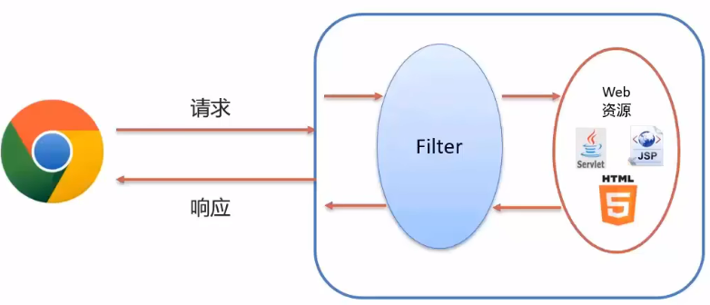
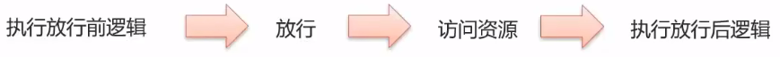
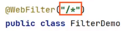

+ 概念: Filter 表示过滤器, 是 JavaWeb 三大组件(Servlet, Filter, Listener)之一
+ 过滤器可以把对资源的请求<font color='orange'>拦截</font>下来, 从而实现一下特殊的功能
+ <font color='orange'>过滤器一般完成一下通用的操作, 比如: 权限控制, 通用编码处理, 敏感字符处理等等</font>



# 快速入门

1. 定义类, 实现 Filter 接口, 并重写方法

```java
public class FilterDemo implements Filter{

        @Override
        public void init(FilterConfig filterConfig) throws ServletException {
            
        }

        @Override
        public void doFilter(ServletRequest servletRequest, ServletResponse servletResponse, FilterChain filterChain) throws IOException, ServletException {

        }

        @Override
        public void destroy() {

        }
    }
```

2. 配置 Filter 拦截资源的路径: 在类上定义 <font color='yellow'>@WebFilter</font> 注解

```java
@WebFilter
public class FilterDemo implements Filter{
```

3. 在 <font color='orange'>doFilter</font> 方法中使用 `filterChain.doFilter()` 放行

```java
public class FilterDemo implements Filter{

        @Override
        public void init(FilterConfig filterConfig) throws ServletException {
            
        }

        @Override
        public void doFilter(ServletRequest servletRequest, ServletResponse servletResponse, FilterChain filterChain) throws IOException, ServletException {
			System.out.println("filter 被执行了");
            filterChain.doFilter(request, response);
        }

        @Override
        public void destroy() {

        }
    }
```


# 执行流程

1. 方行后访问对应资源, 资源访问完成后, 还会回到 Filter 中
2. 如果回到 Filter 中, 将会执行放行后逻辑




# 使用细节

+ Filter 可以根据需求, 配置不同的拦截资源路径



+ 拦截具体的资源: `@WebFilter("/index.jsp")`: 只有访问 `/index.jsp` 会被拦截
+ 拦截目录:  `@WebFilter("/usr/*")`: 访问 `/usr/*` 路径下的所有资源, 都会被拦截
+ 后缀名拦截:  `@WebFilter("*.jsp")`: 访问后缀名为 `jsp` 的资源都会被拦截
+ 拦截所有:  `@WebFilter("/*")`: 只有访问任何资源都会被拦截


```java
@WebFilter(value = "/*")
public class filterDemo implements Filter {
    public void init(FilterConfig config) throws ServletException {
    }

    public void destroy() {
    }

    @Override
    public void doFilter(ServletRequest request, ServletResponse response, FilterChain chain) throws ServletException, IOException {
        //强转获取HttpServletRequest对象
        HttpServletRequest req = (HttpServletRequest) request;

        //排除无需过滤的资源
        String [] urls = {"/css", "/imgs", "/registerServlet",
                "/checkCodeServlet", "/loginServlet", "/register.jsp"};
        String url = req.getRequestURL().toString();
        for(String u : urls){
            if(url.contains(u))
            {
                chain.doFilter(request, response);
                return;//🎁注意这里直接return, 相对于结束filter(记住先放行chain)
            }
        }


        HttpSession session = req.getSession();
        Object user = session.getAttribute("user");

        if (user == null) {
            req.setAttribute("login_msg", "you have not log in!");
            req.getRequestDispatcher("/login.jsp").forward(request, response);
        }else {
            chain.doFilter(request, response);
        }

    }
}

```


## 过滤器链

+ 一个 Web 应用, 可以配置多个过滤器, 称为过滤器链
+ 过滤器链的执行顺序默认下, 按照过滤器类名(字符串)的自然排序


