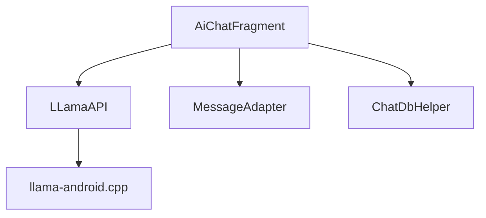

# 语法
```bash
# 远程分支合并
git pull --rebase #使用 rebase 的方式 fetch 到远程分支, 然后 push
git pull #直接使用 merge 的方式 fetch 到远程分支

# 撤销修改
git reset #直接移动分支节点
git revert #通过新建节点抵消之前的修改内容
```

# Git

## 设置git

```shell
git config --global user.name qwqcoder
git config --global user.eamil 1958448979@qq.com
git config --list # 出现end表示进入了编辑模式,按q退出

git config --global http.proxy "socks5://127.0.0.1:7890"
git config --global https.proxy "socks5://127.0.0.1:7890"
```

1. 创建 git 仓库

   ```shell
   git init
   ```

2. 添加文件到暂存区

   ```shell
   # 提交单个文件
   git add 文件名
   
   # 提交当前目录下所有文件
   git add .
   ```

3. 确认修改

   ```shell
   # -m 参数提供注释内容
   git commit -m "注释: 新增了一个版本修改"
   ```

4. 查看 git 节点

   ```shell
   git log
   git log --stat  # 更详细的节点信息
   ```

5. 回溯文件内容

   ```shell
   git reset --hard [commit id]
   git checkout [commit id]
   ```

6. 分支

   ```shell
   # 查看所有分支
   git branch
   
   # 新建分支
   git branch <branchName>
   
   # 删除分支
   git branch -d 分支名 # -D 强制删除
   
   # 强制改变分支指向
   git branch -f <branchName> <hashId> # git branch -f main HEAD^^
   
   # 合并分支
   git merge develop # 合并develop分支给当前分支
   
   # 更改分支名称
   git branch -m master main # 将分支master更改成 main
   
   
   # 切换分支
   git switch <branchName> 
   git switch -c <newBranchName> # 有一个 -c 参数, 支持直接创建分支并转移到该分支
   git switch - # 切换到之前的一个分支
   # ----------------------------------------
   git checkout <branchName>
   git checkout -b <newBranchName> # 有一个 -b 参数, 支持直接创建分支并转移到该分支
   ```

   ><font color='orange'>master 分支: 用于保存经过测试的稳定代码</font>
   >
   >`git init -b dev` 可以在初始化时创建并跳转到dev分支
   >
   >

7. 远程仓库

   ```shell
   # 将推送链接设置为https://github.com/qwqcoder/test 并取别名 origin
   git remote add origin https://github.com/qwqcoder/test
   
   # 查看所有推送链接
   git remote -v
   
   # 将本地参考链接到远程仓库 
   git remote
   
   # 添加与移除
   git remote add 仓库名 地址
   git remote rm 仓库名
   ```

8. 推送分支

   ```shell
   git push <remote> <branch> # remote为远程仓库名称, branch表示推送的本地分支名称
   # -u 或 --set-upstream 参数 将当前分支与远程仓库分支关联,以后git push或git pull就不需要指定远程仓库和本地分支
   git push -u origin master
   # -f 或 -force 参数, 强制推送, 覆盖远程仓库中的内容
   git push -f origin master
   # --all 推送所有分支到远程仓库
   git push --all origin
   # --help
   git push --help
   ```

9. 撤销分支

   ```shell
   # 撤销一次更改
   git reset HEAD^
   
   # 更改远程仓库
   git revert <branchName>
   ```

10. 添加tag

    ```shell
    git tag v1 <branchName>/<hashID>
    ```

11. 查询距离<ref>最近的tag

    ```shell
    git describe <ref>
    ```


# 杂

+ mac 系统 finder 的路径下总是存在 `.DS_Store` 文件
> *解决*
在 `.gitignore` 文件中添加 `.DS_Store` 
+ 在本地仓库中, 使用 `git checkout origin/main` 远程分支总会分离出 `HEAD` 标签, 因为要防止在本地直接修改远程分支的内容




