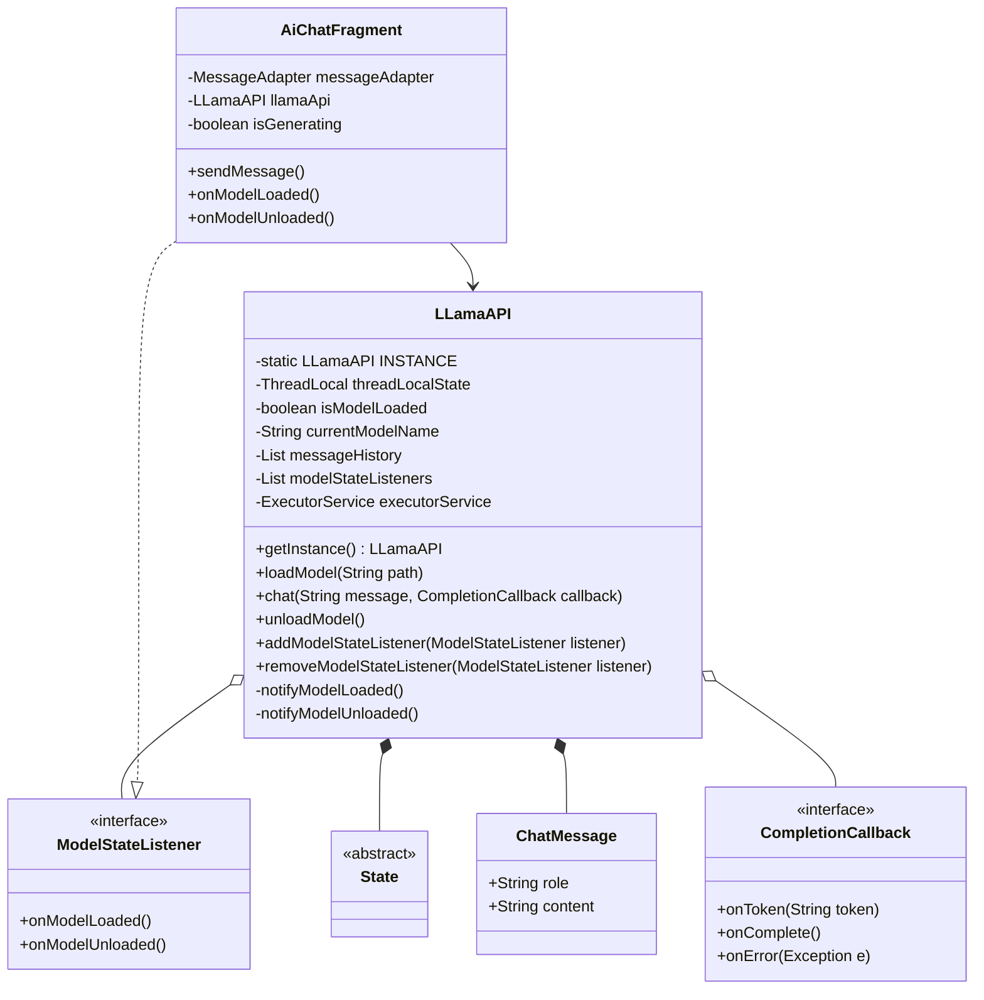
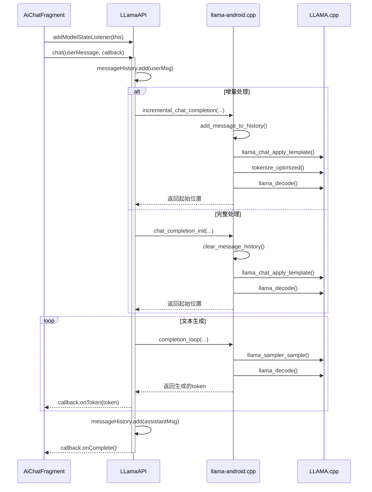
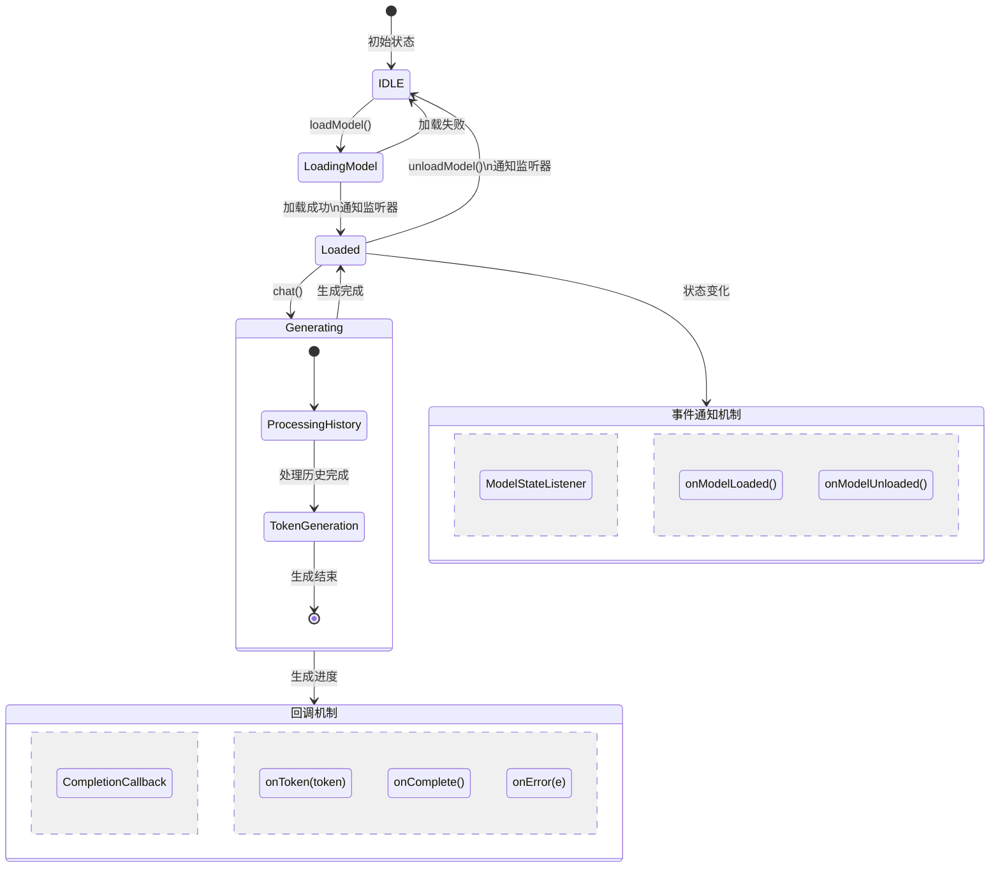
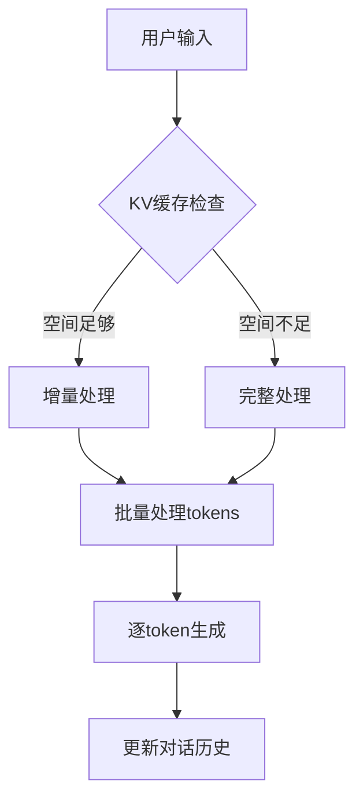
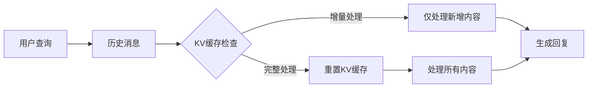
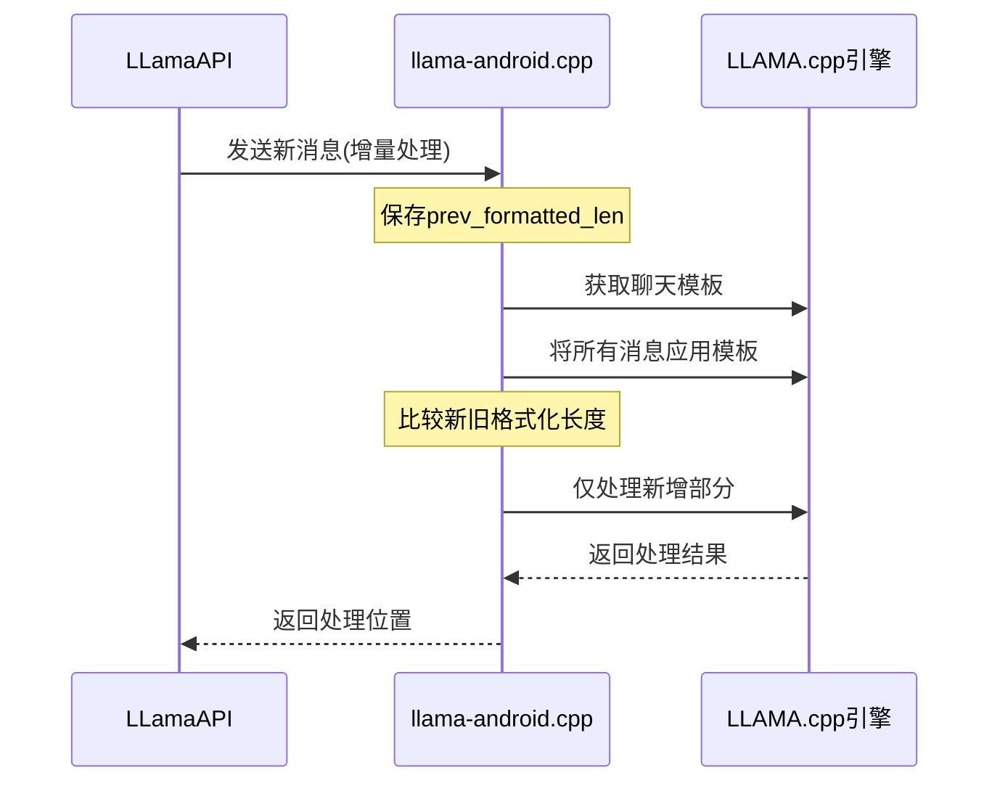
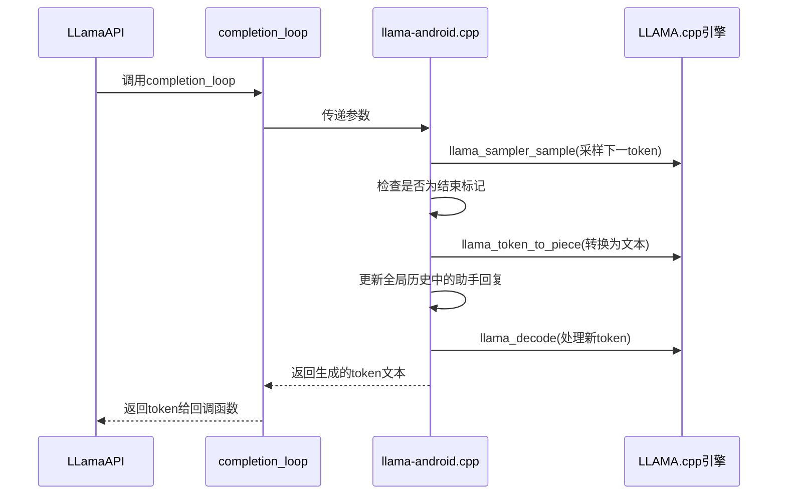
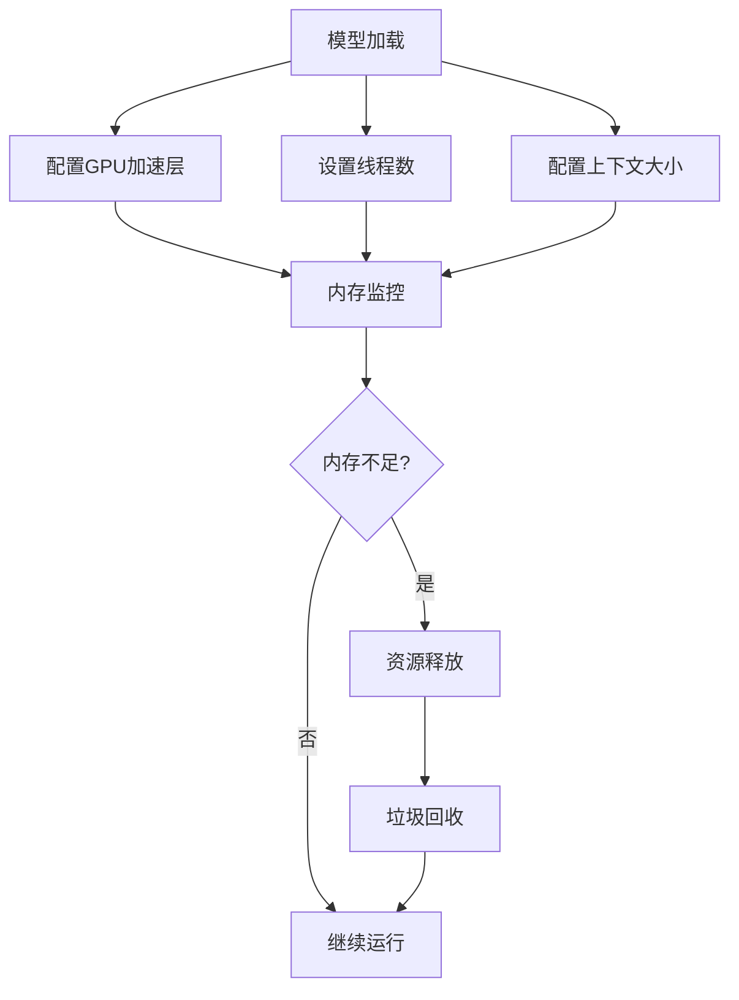

# 语法框架

## 词性种类(9种)

+ **noun**  名词

+ **pronoun**  代词
+ **numeral**  数词
+ **article**  冠词
+ **verb**  动词
+ **adverb**  副词
+ **adjective**  形容词
+ **conjunction**  连词
+ **interjection**  感叹词

## 句子成分(9种)

+ **subject**  主语
+ **attribute**  定语
+ **subject complement**  表语
+ **predicate**  谓语
+ **adverbial**  状语
+ **double object**  双宾
+ **object**  宾语
+ **object complement**  宾补
+ **apposition**  补语

## 句型(8种)

### 简单句

+ **陈述句**

  + 主 + 谓

  > **谓语**必须是**不及物动词**,   例如`I run`, 其中`run`就是一个不及物动词

  + 主 + 谓 + 宾
  + 主 + 系 + 表

  > **系动词**指**be动词[^1]**加上**感官动词[^2]**

  + 主 + 谓 + 表
  + 主 + 谓 + 双宾

  > **双宾**,谓语后面有两个宾语,都是动词的对象[^3]

  + 主 + 谓 + 宾 + 宾补

  > 例句: `They ordered hamburger their lunch`
  >
  > 利用**双宾**的判断方法可以推断出例句是个**宾补结构**

+ **疑问句**

  + 一般疑问句

  > 疑问句由陈述句将**助动词**或**情态动词[^4]**或**系动词**提前转换而来

  + 特殊疑问句

  > 由**疑问词[^5]**发出提问

  + 选择疑问句

  + 反义疑问句

    >  前肯后否,前否后肯,例句: `He is your teacher, isn't he?`

    + 祈使句反义疑问句

    > 例句1: `Let's go to school, shall we?`
    >
    > 例句2: `Let's go outside, will you?`
    >
    > 例句3: `Let's don't go out, shall we?`
    >
    > 例句4: `Don't let us go there, wiil you?`

    + 有**must**的反义疑问句

    > **must**表示**必须**时,反义疑问句要用`mustn't?/needn't?`
    >
    > 例句: `He must study hard at English, mustn't he?`
    >
    > **must**表示**推测(肯定)**时, 反义疑问句用**must**之后的动词的否定提问
    >
    > 例句: `You must be joking, aren't you?`

    + 感叹句反义疑问句

    > 前肯后否, 前面**感叹句**, 后面是**否定式提问**
    >
    > 例句: `What a lovely girl, isn't she?`

    + 否定词反义疑问句

    > 前面是陈述句但是包含一个**否定词**[^6],反义疑问用**肯定提问**
    >
    > 例句: `He hardly goes to school, does he?`

    + 复合反义疑问句

    > 复合反义疑问句,其**反义疑问**都是对**主句**的提问或**与主句相关**除了宾语从句
    >
    > 例句: `She never told you that she had a baby, did she?

    + 宾语从句反义疑问句

    > 例句: `I don't imagine he has got it, has he?`

+ **感叹句**

  + what感叹句

  > `what`+`a/an`+`形容词`+`可数名词单数`+`主语`+谓语
  >
  > 例句: `What a beautiful photo it is!`
  >
  > `what`+`形容词`+`不可数名词/名词复数`+`主语`+谓语
  >
  > 例句: `What clearly water is is!`

  + How感叹句

  > `how`+`形容词/副词`+`主语`+`谓语`
  >
  > 例句: `How careful he is!`
  >
  > `how`+`形容词`+`a/an`+`可数名词单数`+`主语`+`谓语`
  >
  > 例句: `How cute a dog it is!`

  + 语气词感叹句

  > 例句: `Wow!You are so handsome!`

+ **祈使句**

  + 命令/警告祈使句

  > 例句: `Get out!`, `Be quiet, please.`, `Be careful.`

  + 请求/祝愿祈使句

  > 例句: `Have a good day.`, `Let me help you.`

  

### 复合句

+ 名词性从句
+ 定语从句
+ 状语从句

[^1]:am,is,are等等
[^2]: 看,听,尝,闻,感觉,变得,似乎,保持,证明等等
[^3]: 双宾判断,有个技巧,都能做被动语态主语就是双宾,否则就是宾补,例如: 我给(你+钱)=(你)被我给了(钱)=(钱)被我给了(你)
[^4]:can,may,will等
[^5]: who,whose,whom,what,when等等
[^6]: hardly, never, seldom, little, few, nowhere, nothing

